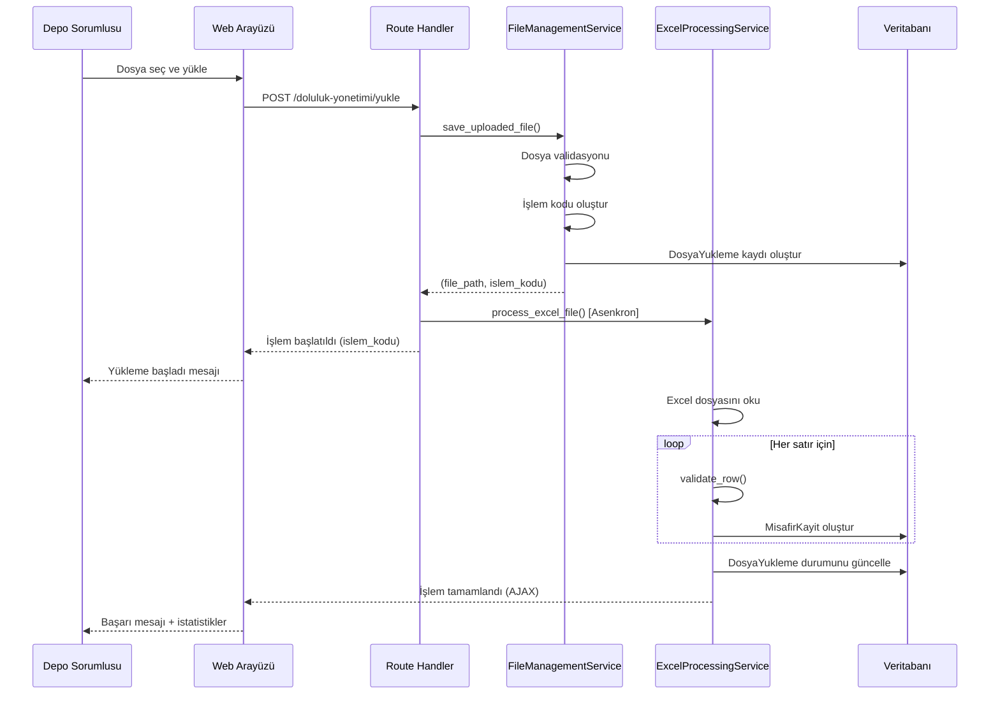
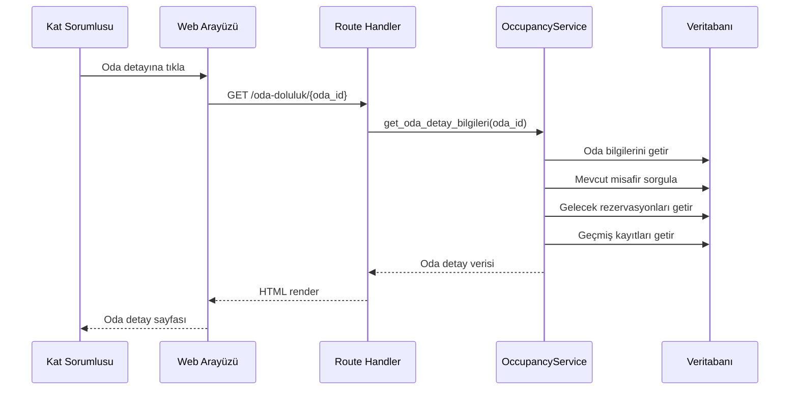
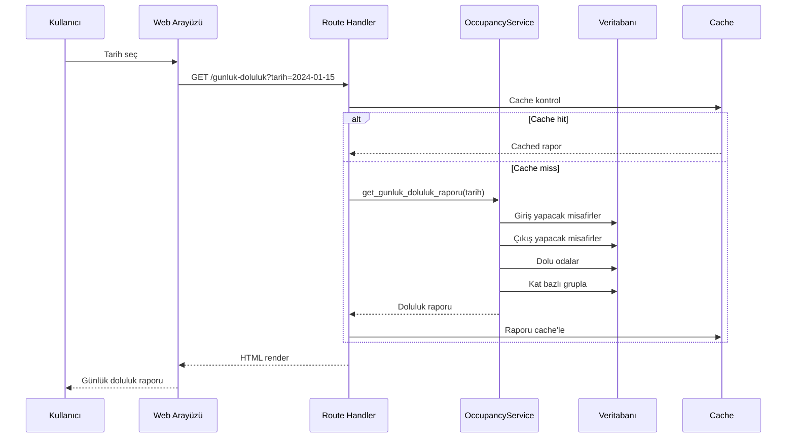
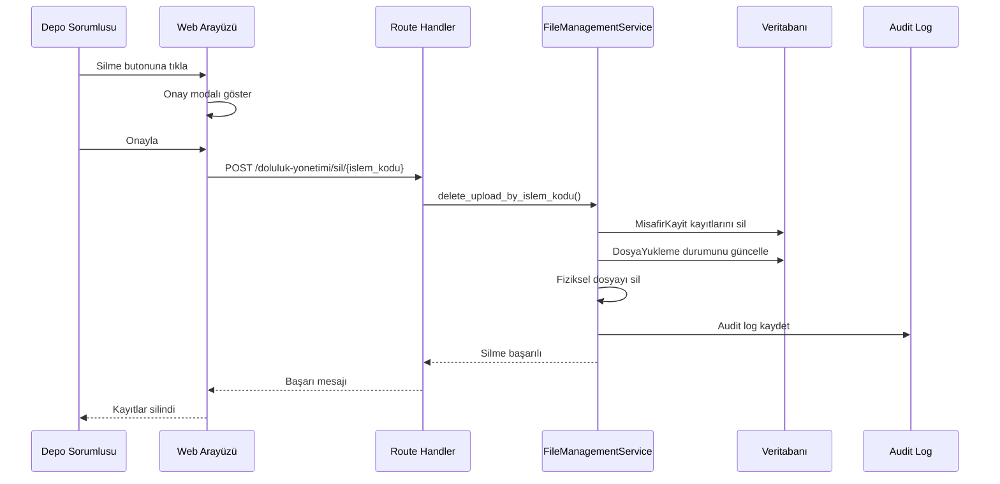
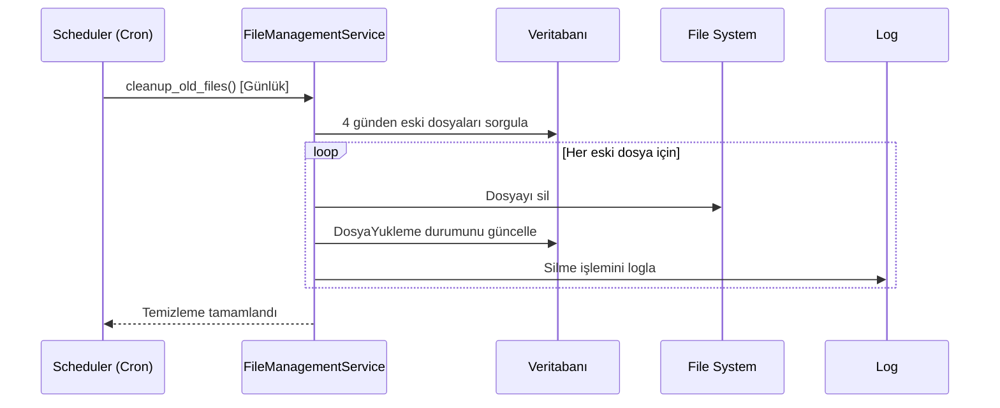

# Otel Doluluk Yönetimi - Tasarım Dökümanı

## Genel Bakış

Bu tasarım, otel odalarının doluluk durumlarını Excel dosyaları üzerinden yönetmek için kapsamlı bir sistem sunar. Sistem, IN HOUSE (mevcut misafirler) ve ARRIVALS (gelecek misafirler) listelerini işleyerek oda doluluk durumlarını otomatik olarak günceller ve kullanıcılara detaylı raporlama imkanı sağlar.

### Temel Özellikler
- Excel dosyası yükleme ve işleme
- Otomatik oda doluluk durumu güncelleme
- Detaylı oda ve misafir bilgileri görüntüleme
- Günlük doluluk raporları
- Hatalı yükleme geri alma mekanizması
- Otomatik dosya temizleme

## Mimari

### Katmanlı Mimari

```
┌─────────────────────────────────────────┐
│         Sunum Katmanı (UI)              │
│  - Doluluk Yönetimi Sayfası             │
│  - Oda Detay Sayfası                    │
│  - Günlük Doluluk Raporu                │
└─────────────────────────────────────────┘
                  ↓
┌─────────────────────────────────────────┐
│         İş Mantığı Katmanı              │
│  - Excel İşleme Servisi                 │
│  - Doluluk Hesaplama Servisi            │
│  - Dosya Yönetim Servisi                │
└─────────────────────────────────────────┘
                  ↓
┌─────────────────────────────────────────┐
│         Veri Erişim Katmanı             │
│  - ODA Model                            │
│  - MisafirKayit Model                   │
│  - DosyaYukleme Model                   │
└─────────────────────────────────────────┘
```


### Teknoloji Stack
- **Backend**: Flask (Python)
- **Database**: PostgreSQL
- **Excel İşleme**: openpyxl veya pandas
- **Frontend**: Jinja2 Templates, Tailwind CSS, JavaScript
- **Dosya Depolama**: Sunucu dosya sistemi (uploads/doluluk/)
- **Asenkron İşleme**: Flask-Executor veya Celery (opsiyonel)

## Bileşenler ve Arayüzler

### 1. Veri Modelleri

#### 1.1 MisafirKayit Modeli

```python
class MisafirKayit(db.Model):
    """Misafir kayıt tablosu - Excel'den yüklenen veriler"""
    __tablename__ = 'misafir_kayitlari'
    
    id = db.Column(db.Integer, primary_key=True)
    oda_id = db.Column(db.Integer, db.ForeignKey('odalar.id'), nullable=False)
    islem_kodu = db.Column(db.String(50), nullable=False, index=True)
    
    # Misafir Bilgileri (İsim kaydedilmez - sadece sayı)
    misafir_sayisi = db.Column(db.Integer, nullable=False)
    
    # Tarih ve Saat Bilgileri
    giris_tarihi = db.Column(db.Date, nullable=False, index=True)
    giris_saati = db.Column(db.Time, nullable=True)  # Sadece ARRIVALS için (Arr.Time)
    cikis_tarihi = db.Column(db.Date, nullable=False, index=True)
    
    # Kayıt Tipi (Otomatik algılanır)
    kayit_tipi = db.Column(db.Enum('in_house', 'arrival', name='misafir_kayit_tipi'), nullable=False)
    
    # Sistem Bilgileri
    olusturma_tarihi = db.Column(db.DateTime(timezone=True), default=datetime.now(timezone.utc))
    olusturan_id = db.Column(db.Integer, db.ForeignKey('kullanicilar.id'))
    
    # İlişkiler
    oda = db.relationship('Oda', backref='misafir_kayitlari')
    olusturan = db.relationship('Kullanici')
```


#### 1.2 DosyaYukleme Modeli

```python
class DosyaYukleme(db.Model):
    """Excel dosya yükleme kayıtları"""
    __tablename__ = 'dosya_yuklemeleri'
    
    id = db.Column(db.Integer, primary_key=True)
    islem_kodu = db.Column(db.String(50), unique=True, nullable=False, index=True)
    
    # Dosya Bilgileri
    dosya_adi = db.Column(db.String(255), nullable=False)
    dosya_yolu = db.Column(db.String(500), nullable=False)
    dosya_tipi = db.Column(db.Enum('in_house', 'arrivals', name='dosya_tipi'), nullable=False)  # Otomatik algılanır
    dosya_boyutu = db.Column(db.Integer)  # bytes
    
    # İşlem Bilgileri
    yukleme_tarihi = db.Column(db.DateTime(timezone=True), default=datetime.now(timezone.utc))
    silme_tarihi = db.Column(db.DateTime(timezone=True))  # Otomatik silme için
    durum = db.Column(db.Enum('yuklendi', 'isleniyor', 'tamamlandi', 'hata', 'silindi', name='yukleme_durum'), default='yuklendi')
    
    # İstatistikler
    toplam_satir = db.Column(db.Integer, default=0)
    basarili_satir = db.Column(db.Integer, default=0)
    hatali_satir = db.Column(db.Integer, default=0)
    hata_detaylari = db.Column(JSONB)  # Hata mesajları
    
    # Kullanıcı Bilgileri
    yuklenen_kullanici_id = db.Column(db.Integer, db.ForeignKey('kullanicilar.id'))
    
    # İlişkiler
    yuklenen_kullanici = db.relationship('Kullanici')
```

### 2. Servis Katmanı

#### 2.1 ExcelProcessingService

Excel dosyalarını işleyen ana servis.

**Sorumluluklar:**
- Excel dosyasını okuma
- Veri doğrulama
- Veritabanına kaydetme
- Hata yönetimi

**Temel Metodlar:**

```python
class ExcelProcessingService:
    
    @staticmethod
    def detect_file_type(headers):
        """
        Excel sütun başlıklarından dosya tipini otomatik algılar
        
        Args:
            headers: Excel'in ilk satırındaki sütun başlıkları
            
        Returns:
            str: 'in_house' veya 'arrivals'
        
        Logic:
            - Eğer 'Hsk.St.' veya 'Arr.Time' varsa -> 'arrivals'
            - Yoksa -> 'in_house'
        """
        pass
    
    @staticmethod
    def process_excel_file(file_path, islem_kodu, user_id):
        """
        Excel dosyasını işler ve veritabanına kaydeder
        
        Args:
            file_path: Dosya yolu
            islem_kodu: Benzersiz işlem kodu
            user_id: Yükleyen kullanıcı ID
            
        Returns:
            dict: İşlem sonucu (başarılı/hatalı satır sayıları, hatalar, dosya_tipi)
        
        Steps:
            1. Excel'i oku
            2. İlk satırdan dosya tipini algıla
            3. Her satırı işle:
               - Room no (oda numarası)
               - Arrival (giriş tarihi)
               - Arr.Time (giriş saati - sadece ARRIVALS için)
               - Departure (çıkış tarihi)
               - Adult (misafir sayısı)
            4. Misafir ismi kaydetme!
        """
        pass
    
    @staticmethod
    def validate_row(row_data):
        """
        Satır verilerini doğrular
        
        Returns:
            tuple: (is_valid, error_message)
        """
        pass
    
    @staticmethod
    def parse_date(date_value):
        """Tarih değerini parse eder"""
        pass
    
    @staticmethod
    def get_or_create_oda(oda_no):
        """Oda numarasına göre oda kaydını getirir veya oluşturur"""
        pass
```


#### 2.2 OccupancyService

Oda doluluk durumlarını hesaplayan servis.

**Sorumluluklar:**
- Belirli bir tarihteki oda doluluk durumunu hesaplama
- Günlük giriş/çıkış sayılarını hesaplama
- Oda detay bilgilerini getirme

**Temel Metodlar:**

```python
class OccupancyService:
    
    @staticmethod
    def get_oda_doluluk_durumu(oda_id, tarih=None):
        """
        Belirli bir odanın belirli bir tarihteki doluluk durumunu döner
        
        Args:
            oda_id: Oda ID
            tarih: Kontrol edilecek tarih (None ise bugün)
            
        Returns:
            dict: {
                'dolu': bool,
                'mevcut_misafir': MisafirKayit veya None,
                'gelecek_rezervasyon': MisafirKayit veya None
            }
        """
        pass
    
    @staticmethod
    def get_gunluk_doluluk_raporu(tarih, otel_id=None):
        """
        Belirli bir tarihteki genel doluluk raporunu döner
        
        Returns:
            dict: {
                'tarih': date,
                'toplam_oda': int,
                'dolu_oda': int,
                'giris_sayisi': int,
                'cikis_sayisi': int,
                'dolu_odalar': [oda_listesi],
                'kat_bazli': {kat_id: {dolu_oda_sayisi, odalar}}
            }
        """
        pass
    
    @staticmethod
    def get_oda_detay_bilgileri(oda_id):
        """
        Odanın detaylı misafir bilgilerini döner
        
        Returns:
            dict: {
                'oda': Oda,
                'mevcut_misafir': MisafirKayit veya None,
                'gelecek_rezervasyonlar': [MisafirKayit listesi],
                'gecmis_kayitlar': [MisafirKayit listesi]
            }
        """
        pass
```


#### 2.3 FileManagementService

Dosya yönetimi servisi.

**Sorumluluklar:**
- Dosya yükleme
- Dosya silme
- Otomatik temizleme

**Temel Metodlar:**

```python
class FileManagementService:
    
    UPLOAD_FOLDER = 'uploads/doluluk/'
    MAX_FILE_SIZE = 10 * 1024 * 1024  # 10 MB
    ALLOWED_EXTENSIONS = {'xlsx', 'xls'}
    FILE_RETENTION_DAYS = 4
    
    @staticmethod
    def save_uploaded_file(file, file_type):
        """
        Yüklenen dosyayı kaydeder
        
        Returns:
            tuple: (file_path, islem_kodu)
        """
        pass
    
    @staticmethod
    def delete_upload_by_islem_kodu(islem_kodu):
        """
        İşlem koduna göre yüklemeyi ve ilgili kayıtları siler
        """
        pass
    
    @staticmethod
    def cleanup_old_files():
        """
        4 günden eski dosyaları otomatik siler
        (Cron job veya scheduler ile çalıştırılacak)
        """
        pass
    
    @staticmethod
    def generate_islem_kodu():
        """
        Benzersiz işlem kodu oluşturur
        Format: DOLULUK-YYYYMMDD-HHMMSS-RANDOM
        """
        pass
```

### 3. Route Katmanı

#### 3.1 Doluluk Yönetimi Route'ları

**Endpoint:** `/doluluk-yonetimi`

```python
@app.route('/doluluk-yonetimi', methods=['GET', 'POST'])
@login_required
@role_required('depo_sorumlusu')
def doluluk_yonetimi():
    """
    Doluluk yönetimi ana sayfası
    - Excel dosyası yükleme
    - Yükleme geçmişi görüntüleme
    """
    pass
```

**Endpoint:** `/doluluk-yonetimi/yukle`

```python
@app.route('/doluluk-yonetimi/yukle', methods=['POST'])
@login_required
@role_required('depo_sorumlusu')
def doluluk_yukle():
    """
    Excel dosyası yükleme ve işleme
    - Dosya validasyonu
    - Asenkron işleme başlatma
    """
    pass
```


**Endpoint:** `/doluluk-yonetimi/sil/<islem_kodu>`

```python
@app.route('/doluluk-yonetimi/sil/<islem_kodu>', methods=['POST'])
@login_required
@role_required('depo_sorumlusu')
def doluluk_sil(islem_kodu):
    """
    Hatalı yüklemeyi geri alma
    - İşlem koduna göre tüm kayıtları silme
    - Audit log kaydı
    """
    pass
```

**Endpoint:** `/doluluk-yonetimi/durum/<islem_kodu>`

```python
@app.route('/doluluk-yonetimi/durum/<islem_kodu>')
@login_required
@role_required('depo_sorumlusu')
def doluluk_durum(islem_kodu):
    """
    Yükleme durumu sorgulama (AJAX)
    - İşlem durumu
    - İlerleme yüzdesi
    """
    pass
```

#### 3.2 Oda Doluluk Route'ları

**Endpoint:** `/oda-doluluk/<int:oda_id>`

```python
@app.route('/oda-doluluk/<int:oda_id>')
@login_required
@role_required(['kat_sorumlusu', 'depo_sorumlusu', 'sistem_yoneticisi'])
def oda_doluluk_detay(oda_id):
    """
    Oda detay sayfası
    - Mevcut misafir bilgileri
    - Gelecek rezervasyonlar
    - Geçmiş kayıtlar
    """
    pass
```

**Endpoint:** `/gunluk-doluluk`

```python
@app.route('/gunluk-doluluk')
@login_required
@role_required(['kat_sorumlusu', 'depo_sorumlusu', 'sistem_yoneticisi'])
def gunluk_doluluk():
    """
    Günlük doluluk raporu
    - Tarih seçimi
    - Giriş/çıkış sayıları
    - Kat bazlı dolu oda listesi
    """
    pass
```

### 4. UI Bileşenleri

#### 4.1 Doluluk Yönetimi Sayfası

**Dosya:** `templates/depo_sorumlusu/doluluk_yonetimi.html`

**Bileşenler:**
- Tek dosya yükleme formu (sistem otomatik algılar IN HOUSE veya ARRIVALS)
- Yükleme geçmişi tablosu (dosya tipi otomatik gösterilir)
- İşlem kodu ile silme butonu
- İlerleme göstergesi (asenkron işleme için)

**Özellikler:**
- Drag & drop dosya yükleme
- Otomatik dosya tipi algılama (sütun başlıklarından)
- Gerçek zamanlı ilerleme takibi
- Hata detayları modal
- Başarılı/hatalı satır sayıları
- Dosya tipi badge'i (IN HOUSE / ARRIVALS)


#### 4.2 Oda Detay Sayfası

**Dosya:** `templates/kat_sorumlusu/oda_doluluk_detay.html`

**Bileşenler:**
- Oda bilgileri kartı (oda no, kat, tip)
- Mevcut misafir bilgileri (varsa)
  - Giriş tarihi
  - Çıkış tarihi
  - Kalan gün sayısı
  - Misafir sayısı
  - NOT: Misafir ismi gösterilmez!
- Gelecek rezervasyonlar listesi
  - Giriş tarihi ve saati (ARRIVALS için)
  - Çıkış tarihi
  - Misafir sayısı
- Geçmiş kayıtlar (son 10 kayıt)

**Özellikler:**
- Responsive tasarım
- Tarih ve saat hesaplamaları (kalan gün, geçen gün)
- Renk kodlaması (bugün çıkış, yarın giriş vb.)
- Sadece oda no, tarihler, saat (varsa) ve misafir sayısı gösterilir

#### 4.3 Günlük Doluluk Raporu

**Dosya:** `templates/kat_sorumlusu/gunluk_doluluk.html`

**Bileşenler:**
- Tarih seçici (datepicker)
- Özet istatistikler kartları
  - Toplam oda sayısı
  - Dolu oda sayısı
  - Bugün giriş yapacak misafir sayısı
  - Bugün çıkış yapacak misafir sayısı
- Kat bazlı dolu oda listesi
- Detaylı oda tablosu

**Özellikler:**
- Filtreleme (kat, doluluk durumu)
- Export (PDF, Excel)
- Yazdırma özelliği

### 5. Veritabanı Şeması

#### İlişki Diyagramı

```
┌─────────────────┐         ┌──────────────────┐
│   Kullanici     │         │      Otel        │
│                 │         │                  │
│ - id            │         │ - id             │
│ - kullanici_adi │         │ - ad             │
│ - rol           │         │ - aktif          │
└────────┬────────┘         └────────┬─────────┘
         │                           │
         │                           │
         │                  ┌────────▼─────────┐
         │                  │       Kat        │
         │                  │                  │
         │                  │ - id             │
         │                  │ - otel_id        │
         │                  │ - kat_adi        │
         │                  └────────┬─────────┘
         │                           │
         │                  ┌────────▼─────────┐
         │                  │       Oda        │
         │                  │                  │
         │                  │ - id             │
         │                  │ - kat_id         │
         │                  │ - oda_no         │
         │                  │ - oda_tipi       │
         │                  └────────┬─────────┘
         │                           │
         │                           │
┌────────▼────────┐         ┌────────▼─────────┐
│ DosyaYukleme    │         │  MisafirKayit    │
│                 │         │                  │
│ - id            │         │ - id             │
│ - islem_kodu    │◄────────┤ - islem_kodu     │
│ - dosya_adi     │         │ - oda_id         │
│ - dosya_tipi    │         │ - giris_tarihi   │
│ - durum         │         │ - cikis_tarihi   │
│ - yuklenen_     │         │ - misafir_sayisi │
│   kullanici_id  │         │ - kayit_tipi     │
└─────────────────┘         └──────────────────┘
```


#### İndeksler

Performans optimizasyonu için gerekli indeksler:

```python
# MisafirKayit tablosu
- Index('idx_misafir_islem_kodu', 'islem_kodu')
- Index('idx_misafir_oda_tarih', 'oda_id', 'giris_tarihi', 'cikis_tarihi')
- Index('idx_misafir_giris', 'giris_tarihi')
- Index('idx_misafir_cikis', 'cikis_tarihi')

# DosyaYukleme tablosu
- Index('idx_dosya_islem_kodu', 'islem_kodu')
- Index('idx_dosya_yukleme_tarihi', 'yukleme_tarihi')
- Index('idx_dosya_silme_tarihi', 'silme_tarihi')
```

## Hata Yönetimi

### 1. Dosya Yükleme Hataları

**Hata Tipleri:**
- Geçersiz dosya formatı
- Dosya boyutu aşımı
- Eksik sütunlar
- Geçersiz veri formatları

**Çözüm Stratejisi:**
- Kullanıcıya anlaşılır hata mesajları
- Hata detaylarını log'a kaydetme
- Kısmi başarı durumunda başarılı satırları kaydetme

### 2. Veri Doğrulama Hataları

**Kontroller:**
- Oda numarası sistemde kayıtlı mı?
- Tarih formatı geçerli mi?
- Giriş tarihi çıkış tarihinden önce mi?
- Misafir sayısı pozitif tam sayı mı?

**Çözüm Stratejisi:**
- Satır bazında hata raporlama
- Hatalı satırları atlayıp devam etme
- Detaylı hata raporu oluşturma

### 3. Veritabanı Hataları

**Senaryolar:**
- Bağlantı hatası
- Transaction timeout
- Constraint ihlali

**Çözüm Stratejisi:**
- Rollback mekanizması
- Retry logic (3 deneme)
- Kullanıcıya bilgilendirme

### 4. Dosya Sistemi Hataları

**Senaryolar:**
- Disk alanı yetersiz
- Yazma izni yok
- Dosya bulunamadı

**Çözüm Stratejisi:**
- Yükleme öncesi alan kontrolü
- Graceful degradation
- Admin bilgilendirme

## Test Stratejisi

### 1. Birim Testleri

**Test Edilecek Bileşenler:**
- ExcelProcessingService
  - validate_row()
  - parse_date()
  - get_or_create_oda()
- OccupancyService
  - get_oda_doluluk_durumu()
  - get_gunluk_doluluk_raporu()
- FileManagementService
  - generate_islem_kodu()
  - cleanup_old_files()

**Test Senaryoları:**
- Geçerli veri işleme
- Geçersiz veri işleme
- Edge case'ler (boş değerler, null, sınır değerler)


### 2. Entegrasyon Testleri

**Test Senaryoları:**
- Excel dosyası yükleme ve işleme (end-to-end)
- Oda doluluk durumu güncelleme
- Günlük doluluk raporu oluşturma
- Hatalı yükleme geri alma
- Otomatik dosya temizleme

### 3. UI Testleri

**Test Senaryoları:**
- Dosya yükleme formu
- İlerleme göstergesi
- Hata mesajları görüntüleme
- Oda detay sayfası
- Günlük doluluk raporu

### 4. Performans Testleri

**Test Senaryoları:**
- 500 satırlık Excel dosyası işleme süresi (< 30 saniye)
- 1000 odalı otel için günlük doluluk raporu (< 2 saniye)
- Eşzamanlı dosya yükleme (5 kullanıcı)

## Güvenlik Önlemleri

### 1. Dosya Güvenliği

**Önlemler:**
- Dosya uzantısı kontrolü (sadece .xlsx, .xls)
- Dosya boyutu limiti (10 MB)
- Dosya içeriği taraması (malware)
- Güvenli dosya adı oluşturma (UUID)

### 2. Yetkilendirme

**Kontroller:**
- Role-based access control (RBAC)
- Endpoint seviyesinde yetki kontrolü
- Otel bazlı veri filtreleme

### 3. Veri Güvenliği

**Önlemler:**
- SQL injection koruması (ORM kullanımı)
- XSS koruması (template escaping)
- CSRF token kontrolü

### 4. Audit Trail

**Kayıtlar:**
- Dosya yükleme işlemleri
- Veri silme işlemleri
- Hatalı erişim denemeleri

## Performans Optimizasyonu

### 1. Veritabanı Optimizasyonu

**Stratejiler:**
- Uygun indeksler
- Batch insert (toplu ekleme)
- Query optimizasyonu
- Connection pooling

### 2. Dosya İşleme Optimizasyonu

**Stratejiler:**
- Chunk-based reading (parça parça okuma)
- Asenkron işleme
- Memory-efficient processing

### 3. Caching

**Stratejiler:**
- Günlük doluluk raporu cache (1 saat)
- Oda listesi cache (5 dakika)
- Redis veya in-memory cache


## Uygulama Akışları

### 1. Excel Dosyası Yükleme Akışı



### 2. Oda Doluluk Sorgulama Akışı



### 3. Günlük Doluluk Raporu Akışı




### 4. Hatalı Yükleme Geri Alma Akışı



### 5. Otomatik Dosya Temizleme Akışı



## Deployment Notları

### 1. Gerekli Paketler

```txt
openpyxl==3.1.2          # Excel dosya işleme
pandas==2.1.0            # Veri işleme (opsiyonel)
Flask-Executor==1.0.0    # Asenkron işleme
APScheduler==3.10.4      # Zamanlanmış görevler
```

### 2. Ortam Değişkenleri

```env
# Dosya yükleme ayarları
UPLOAD_FOLDER=uploads/doluluk/
MAX_FILE_SIZE=10485760  # 10 MB
FILE_RETENTION_DAYS=4

# Asenkron işleme
EXECUTOR_TYPE=thread
EXECUTOR_MAX_WORKERS=5
```

### 3. Dizin Yapısı

```
uploads/
└── doluluk/
    ├── in_house/
    └── arrivals/
```

### 4. Cron Job Kurulumu

```bash
# Her gün saat 02:00'de eski dosyaları temizle
0 2 * * * /usr/bin/python /path/to/app/cleanup_old_files.py
```

### 5. Veritabanı Migration

```bash
# Migration oluştur
flask db migrate -m "Add occupancy management tables"

# Migration uygula
flask db upgrade
```

## Gelecek Geliştirmeler

### Faz 2 Özellikleri
- Otomatik Excel indirme (PMS entegrasyonu)
- Gerçek zamanlı bildirimler (WebSocket)
- Mobil uygulama desteği
- Gelişmiş raporlama (grafikler, trendler)
- Tahminleme algoritmaları (doluluk tahmini)

### Faz 3 Özellikleri
- API entegrasyonu (REST API)
- Çoklu otel desteği
- Gelişmiş filtreleme ve arama
- Export özellikleri (PDF, Excel)
- Dashboard widget'ları
