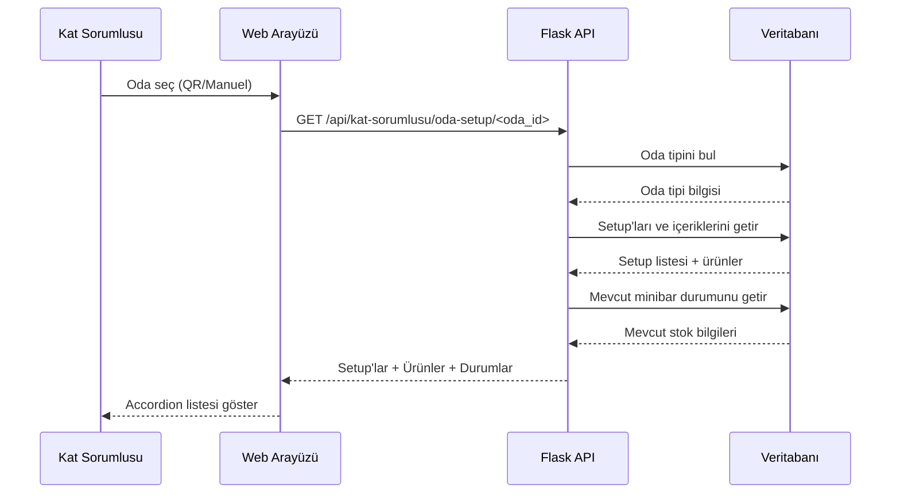

# Setup Bazlı Minibar Kontrol Sistemi - Tasarım Dokümanı

## Genel Bakış

Bu tasarım, minibar kontrol sistemini setup-bazlı bir yapıya dönüştürür. Artık her oda tipinin tanımlı setup'ları (dolap içi/dışı) olduğu için, kat sorumlusu oda seçtiğinde otomatik olarak o odanın setup'larına göre bulunması gereken ürünler listelenir. Sistem, tüketim hesaplamalarını otomatik yapar ve ekstra ürün yönetimini destekler.

## Mimari

### Katmanlar

```
┌─────────────────────────────────────────┐
│         Presentation Layer              │
│  (Templates + JavaScript + CSS)         │
└─────────────────────────────────────────┘
                  ↓
┌─────────────────────────────────────────┐
│         Application Layer               │
│  (Flask Routes + Business Logic)        │
└─────────────────────────────────────────┘
                  ↓
┌─────────────────────────────────────────┐
│         Data Access Layer               │
│  (SQLAlchemy Models + Queries)          │
└─────────────────────────────────────────┘
                  ↓
┌─────────────────────────────────────────┐
│         Database Layer                  │
│  (PostgreSQL)                           │
└─────────────────────────────────────────┘
```

### Veri Akışı



## Bileşenler ve Arayüzler

### 1. Frontend Bileşenleri

#### 1.1 Minibar Kontrol Sayfası

**Dosya:** `templates/kat_sorumlusu/minibar_kontrol.html`

**Bileşenler:**

- Oda seçim alanı (QR tarama + Manuel dropdown)
- Setup accordion listesi
- Ürün tablosu (her setup için)
- Ekleme modalı
- Ekstra ekleme modalı
- Sıfırlama modalı

#### 1.2 JavaScript Modülleri

**Dosya:** `static/js/minibar_kontrol.js`

**Fonksiyonlar:**

```javascript
// Oda seçimi ve setup yükleme
async function odaSecildi(odaId)
async function setupListesiYukle(odaId)

// Accordion yönetimi
function accordionAc(setupId)
function accordionKapat(setupId)

// Ürün işlemleri
function urunEkleModalAc(setupId, urunId)
function ekstraEkleModalAc(setupId, urunId)
function ekstraSifirlaModalAc(setupId, urunId)

// API çağrıları
async function urunEkle(data)
async function ekstraEkle(data)
async function ekstraSifirla(data)

// Yardımcı fonksiyonlar
function durumRengiGetir(durum)
function toastGoster(mesaj, tip)
```

### 2. Backend Bileşenleri

#### 2.1 Route Modülü

**Dosya:** `routes/kat_sorumlusu_routes.py`

**Endpoint'ler:**

```python
@app.route('/minibar-kontrol')
def minibar_kontrol()
    # Ana sayfa render

@app.route('/api/kat-sorumlusu/oda-setup/<int:oda_id>')
def oda_setup_getir(oda_id)
    # Oda setup'larını ve durumlarını getir

@app.route('/api/kat-sorumlusu/urun-ekle', methods=['POST'])
def urun_ekle()
    # Eksik ürün ekleme ve tüketim kaydetme

@app.route('/api/kat-sorumlusu/ekstra-ekle', methods=['POST'])
def ekstra_ekle()
    # Setup üstü ekstra ürün ekleme

@app.route('/api/kat-sorumlusu/ekstra-sifirla', methods=['POST'])
def ekstra_sifirla()
    # Ekstra ürün tüketimini kaydet ve sıfırla
```

#### 2.2 Servis Katmanı

**Dosya:** `utils/minibar_servisleri.py`

**Fonksiyonlar:**

```python
def oda_setup_durumu_getir(oda_id):
    """Odanın tüm setup'larını ve mevcut durumlarını getirir"""

def tuketim_hesapla(oda_id, urun_id, setup_miktari, eklenen_miktar):
    """Tüketim miktarını hesaplar"""

def zimmet_stok_kontrol(personel_id, urun_id, miktar):
    """Kat sorumlusunun zimmetinde yeterli stok var mı kontrol eder"""

def zimmet_stok_dusu(personel_id, urun_id, miktar, zimmet_detay_id=None):
    """Zimmet stoğundan düşüş yapar"""

def minibar_stok_guncelle(oda_id, urun_id, yeni_miktar, ekstra_miktar=0):
    """Minibar stok miktarını günceller"""

def tuketim_kaydet(oda_id, urun_id, miktar, personel_id):
    """Tüketimi minibar_islem tablosuna kaydeder"""
```

## Veri Modelleri

### Mevcut Modeller (Kullanılacak)

#### 1. Setup Model

```python
class Setup(db.Model):
    id = db.Column(db.Integer, primary_key=True)
    ad = db.Column(db.String(100), nullable=False, unique=True)
    aciklama = db.Column(db.String(500))
    dolap_ici = db.Column(db.Boolean, default=True)
    aktif = db.Column(db.Boolean, default=True)
    olusturma_tarihi = db.Column(db.DateTime(timezone=True))

    # İlişkiler
    icerikler = db.relationship('SetupIcerik', backref='setup')
```

#### 2. SetupIcerik Model

```python
class SetupIcerik(db.Model):
    id = db.Column(db.Integer, primary_key=True)
    setup_id = db.Column(db.Integer, db.ForeignKey('setuplar.id'))
    urun_id = db.Column(db.Integer, db.ForeignKey('urunler.id'))
    adet = db.Column(db.Integer, nullable=False, default=1)
    olusturma_tarihi = db.Column(db.DateTime(timezone=True))

    # İlişkiler
    urun = db.relationship('Urun', backref='setup_icerikler')
```

#### 3. OdaTipi Model

```python
class OdaTipi(db.Model):
    id = db.Column(db.Integer, primary_key=True)
    ad = db.Column(db.String(100), nullable=False, unique=True)
    dolap_sayisi = db.Column(db.Integer, default=0)
    aktif = db.Column(db.Boolean, default=True)

    # Many-to-Many ilişki
    setuplar = db.relationship('Setup', secondary=oda_tipi_setup)
```

#### 4. Oda Model

```python
class Oda(db.Model):
    id = db.Column(db.Integer, primary_key=True)
    kat_id = db.Column(db.Integer, db.ForeignKey('katlar.id'))
    oda_no = db.Column(db.String(20), nullable=False, unique=True)
    oda_tipi_id = db.Column(db.Integer, db.ForeignKey('oda_tipleri.id'))

    # İlişkiler
    oda_tipi_rel = db.relationship('OdaTipi', foreign_keys=[oda_tipi_id])
```

### Yeni/Güncellenecek Modeller

#### 5. MinibarZimmetDetay Model (YENİ ALAN)

```python
class MinibarZimmetDetay(db.Model):
    """Odaların minibar stok durumu"""
    __tablename__ = 'minibar_zimmet_detay'

    id = db.Column(db.Integer, primary_key=True)
    oda_id = db.Column(db.Integer, db.ForeignKey('odalar.id'))
    urun_id = db.Column(db.Integer, db.ForeignKey('urunler.id'))
    setup_id = db.Column(db.Integer, db.ForeignKey('setuplar.id'))
    mevcut_miktar = db.Column(db.Integer, default=0)
    ekstra_miktar = db.Column(db.Integer, default=0)  # YENİ ALAN
    son_guncelleme = db.Column(db.DateTime(timezone=True))

    # İlişkiler
    oda = db.relationship('Oda')
    urun = db.relationship('Urun')
    setup = db.relationship('Setup')
```

**Not:** Eğer `minibar_zimmet_detay` tablosu yoksa, `MinibarIslemDetay` tablosunu kullanarak mevcut durumu takip edeceğiz.

#### 6. MinibarIslem Model (Mevcut - Kullanılacak)

```python
class MinibarIslem(db.Model):
    id = db.Column(db.Integer, primary_key=True)
    oda_id = db.Column(db.Integer, db.ForeignKey('odalar.id'))
    personel_id = db.Column(db.Integer, db.ForeignKey('kullanicilar.id'))
    islem_tipi = db.Column(db.Enum(..., 'setup_kontrol', 'ekstra_ekleme'))
    islem_tarihi = db.Column(db.DateTime(timezone=True))
    aciklama = db.Column(db.Text)
```

**Yeni İşlem Tipleri:**

- `setup_kontrol`: Setup bazlı kontrol ve dolum
- `ekstra_ekleme`: Ekstra ürün ekleme
- `ekstra_tuketim`: Ekstra ürün tüketimi

#### 7. MinibarIslemDetay Model (Mevcut - Kullanılacak)

```python
class MinibarIslemDetay(db.Model):
    id = db.Column(db.Integer, primary_key=True)
    islem_id = db.Column(db.Integer, db.ForeignKey('minibar_islemleri.id'))
    urun_id = db.Column(db.Integer, db.ForeignKey('urunler.id'))
    baslangic_stok = db.Column(db.Integer, default=0)
    bitis_stok = db.Column(db.Integer, default=0)
    tuketim = db.Column(db.Integer, default=0)
    eklenen_miktar = db.Column(db.Integer, default=0)
    zimmet_detay_id = db.Column(db.Integer)
```

### Veritabanı Değişiklikleri

#### Migration Script

```python
# migrations/add_ekstra_miktar_column.py

def upgrade():
    # Eğer minibar_zimmet_detay tablosu varsa
    op.add_column('minibar_zimmet_detay',
        sa.Column('ekstra_miktar', sa.Integer(), default=0))

    # MinibarIslemTipi enum'una yeni değerler ekle
    op.execute("ALTER TYPE minibar_islem_tipi ADD VALUE 'setup_kontrol'")
    op.execute("ALTER TYPE minibar_islem_tipi ADD VALUE 'ekstra_ekleme'")
    op.execute("ALTER TYPE minibar_islem_tipi ADD VALUE 'ekstra_tuketim'")

def downgrade():
    # Rollback işlemleri
    op.drop_column('minibar_zimmet_detay', 'ekstra_miktar')
```

## API Tasarımı

### 1. Oda Setup Durumu Getir

**Endpoint:** `GET /api/kat-sorumlusu/oda-setup/<oda_id>`

**Request:**

```
GET /api/kat-sorumlusu/oda-setup/101
```

**Response:**

```json
{
  "success": true,
  "oda": {
    "id": 101,
    "oda_no": "101",
    "oda_tipi": "Deluxe",
    "oda_tipi_id": 2
  },
  "setuplar": [
    {
      "setup_id": 1,
      "setup_adi": "MINI - Dolap İçi",
      "dolap_ici": true,
      "dolap_sayisi": 1,
      "urunler": [
        {
          "urun_id": 5,
          "urun_adi": "Pepsi 250ml",
          "birim": "Adet",
          "setup_miktari": 2,
          "mevcut_miktar": 1,
          "ekstra_miktar": 0,
          "durum": "eksik",
          "eksik_miktar": 1
        },
        {
          "urun_id": 8,
          "urun_adi": "Efes Bira 330ml",
          "birim": "Adet",
          "setup_miktari": 4,
          "mevcut_miktar": 6,
          "ekstra_miktar": 2,
          "durum": "ekstra_var",
          "fazla_miktar": 2
        }
      ]
    },
    {
      "setup_id": 3,
      "setup_adi": "Snack - Dolap Dışı",
      "dolap_ici": false,
      "dolap_sayisi": 0,
      "urunler": [
        {
          "urun_id": 15,
          "urun_adi": "Çikolata",
          "birim": "Adet",
          "setup_miktari": 3,
          "mevcut_miktar": 3,
          "ekstra_miktar": 0,
          "durum": "tam",
          "eksik_miktar": 0
        }
      ]
    }
  ],
  "kat_sorumlusu_stok": {
    "5": 50,
    "8": 30,
    "15": 20
  }
}
```

### 2. Ürün Ekle (Eksik Tamamlama)

**Endpoint:** `POST /api/kat-sorumlusu/urun-ekle`

**Request:**

```json
{
  "oda_id": 101,
  "urun_id": 5,
  "setup_id": 1,
  "eklenen_miktar": 1,
  "zimmet_detay_id": 45
}
```

**Response:**

```json
{
  "success": true,
  "message": "Ürün başarıyla eklendi",
  "tuketim": 1,
  "yeni_miktar": 2,
  "zimmet_kalan": 49
}
```

**Hata Response:**

```json
{
  "success": false,
  "error": "Zimmetinizde yeterli stok bulunmamaktadır",
  "zimmet_mevcut": 0,
  "gereken_miktar": 1
}
```

### 3. Ekstra Ürün Ekle

**Endpoint:** `POST /api/kat-sorumlusu/ekstra-ekle`

**Request:**

```json
{
  "oda_id": 101,
  "urun_id": 8,
  "setup_id": 1,
  "ekstra_miktar": 2,
  "zimmet_detay_id": 46
}
```

**Response:**

```json
{
  "success": true,
  "message": "Ekstra ürün başarıyla eklendi",
  "yeni_miktar": 6,
  "ekstra_miktar": 2,
  "zimmet_kalan": 28
}
```

### 4. Ekstra Ürün Sıfırla

**Endpoint:** `POST /api/kat-sorumlusu/ekstra-sifirla`

**Request:**

```json
{
  "oda_id": 101,
  "urun_id": 8,
  "setup_id": 1
}
```

**Response:**

```json
{
  "success": true,
  "message": "Ekstra ürün tüketimi kaydedildi",
  "tuketim": 2,
  "yeni_miktar": 4,
  "ekstra_miktar": 0
}
```

## İş Mantığı Akışları

### 1. Oda Seçimi ve Setup Listeleme Akışı

```
1. Kat sorumlusu oda seçer (QR veya manuel)
2. Sistem oda_id'yi alır
3. Odanın oda_tipi_id'sini bulur
4. Oda tipine bağlı tüm setup'ları getirir (oda_tipi_setup tablosundan)
5. Her setup için:
   a. Setup içeriğini getirir (setup_icerik tablosundan)
   b. Her ürün için mevcut durumu hesaplar:
      - Son minibar işleminden mevcut_miktar'ı bulur
      - Ekstra_miktar varsa ekler
      - Setup miktarı ile karşılaştırır
      - Durum belirler (tam/eksik/ekstra_var)
6. Kat sorumlusunun zimmet stoklarını getirir
7. Tüm veriyi JSON olarak döner
```

### 2. Ürün Ekleme (Eksik Tamamlama) Akışı

```
1. Kat sorumlusu "Ekle" butonuna tıklar
2. Modal açılır, ürün bilgileri gösterilir
3. Kat sorumlusu eklenecek miktarı girer
4. "Kaydet" butonuna tıklar
5. Sistem kontroller yapar:
   a. Zimmet stoğu yeterli mi?
   b. Miktar pozitif mi?
6. Transaction başlatılır:
   a. Tüketim hesaplanır: (setup_miktari - mevcut_miktar)
   b. Zimmet stoğundan düşüş yapılır
   c. MinibarIslem kaydı oluşturulur (islem_tipi: 'setup_kontrol')
   d. MinibarIslemDetay kaydı oluşturulur:
      - baslangic_stok: mevcut_miktar
      - eklenen_miktar: girilen_miktar
      - tuketim: hesaplanan_tuketim
      - bitis_stok: setup_miktari
   e. Minibar stok güncellenir (mevcut_miktar = setup_miktari)
   f. Audit log kaydedilir
7. Transaction commit edilir
8. Başarı mesajı gösterilir
9. Setup listesi güncellenir
```

### 3. Ekstra Ürün Ekleme Akışı

```
1. Kat sorumlusu "Ekstra" butonuna tıklar
2. Modal açılır, ürün bilgileri gösterilir
3. Kat sorumlusu ekstra miktarı girer
4. "Kaydet" butonuna tıklar
5. Sistem kontroller yapar:
   a. Zimmet stoğu yeterli mi?
   b. Miktar pozitif mi?
6. Transaction başlatılır:
   a. Zimmet stoğundan düşüş yapılır
   b. MinibarIslem kaydı oluşturulur (islem_tipi: 'ekstra_ekleme')
   c. MinibarIslemDetay kaydı oluşturulur:
      - baslangic_stok: mevcut_miktar
      - eklenen_miktar: ekstra_miktar
      - tuketim: 0 (ekstra tüketim değil!)
      - bitis_stok: mevcut_miktar + ekstra_miktar
   d. Minibar stok güncellenir:
      - mevcut_miktar += ekstra_miktar
      - ekstra_miktar alanı güncellenir
   e. Audit log kaydedilir
7. Transaction commit edilir
8. Başarı mesajı gösterilir
9. Setup listesi güncellenir (ekstra gösterilir)
```

### 4. Ekstra Ürün Sıfırlama Akışı

```
1. Kat sorumlusu "Sıfırla" butonuna tıklar
2. Onay modalı açılır
3. Kat sorumlusu onaylar
4. Transaction başlatılır:
   a. MinibarIslem kaydı oluşturulur (islem_tipi: 'ekstra_tuketim')
   b. MinibarIslemDetay kaydı oluşturulur:
      - baslangic_stok: mevcut_miktar
      - tuketim: ekstra_miktar (şimdi tüketim olarak kaydedilir!)
      - bitis_stok: setup_miktari
   c. Minibar stok güncellenir:
      - mevcut_miktar = setup_miktari
      - ekstra_miktar = 0
   d. Audit log kaydedilir
5. Transaction commit edilir
6. Başarı mesajı gösterilir
7. Setup listesi güncellenir (ekstra kaldırılır)
```

## Hata Yönetimi

### Hata Tipleri ve Çözümleri

#### 1. Zimmet Stok Yetersizliği

```python
class ZimmetStokYetersizError(Exception):
    def __init__(self, urun_adi, mevcut, gereken):
        self.message = f"Zimmetinizde yeterli {urun_adi} bulunmamaktadır. Mevcut: {mevcut}, Gereken: {gereken}"
        super().__init__(self.message)
```

**Çözüm:** Kullanıcıya hata mesajı göster, işlemi iptal et.

#### 2. Oda Tipi Bulunamadı

```python
class OdaTipiNotFoundError(Exception):
    def __init__(self, oda_no):
        self.message = f"{oda_no} numaralı odaya oda tipi atanmamış"
        super().__init__(self.message)
```

**Çözüm:** Kullanıcıya uyarı göster, sistem yöneticisine bildir.

#### 3. Setup Bulunamadı

```python
class SetupNotFoundError(Exception):
    def __init__(self, oda_tipi):
        self.message = f"{oda_tipi} oda tipine setup atanmamış"
        super().__init__(self.message)
```

**Çözüm:** Kullanıcıya uyarı göster, boş liste döndür.

#### 4. Veritabanı Hatası

```python
try:
    db.session.commit()
except Exception as e:
    db.session.rollback()
    log_hata(e, modul='minibar_kontrol')
    raise DatabaseError("İşlem sırasında bir hata oluştu")
```

**Çözüm:** Transaction rollback, hata logla, kullanıcıya genel hata mesajı göster.

### Try-Catch Blokları

```python
@app.route('/api/kat-sorumlusu/urun-ekle', methods=['POST'])
@login_required
@role_required('kat_sorumlusu')
def urun_ekle():
    try:
        # İşlem mantığı
        data = request.get_json()

        # Validasyon
        if not data or 'oda_id' not in data:
            return jsonify({'success': False, 'error': 'Geçersiz istek'}), 400

        # İş mantığı
        result = minibar_servisleri.urun_ekle(
            oda_id=data['oda_id'],
            urun_id=data['urun_id'],
            setup_id=data['setup_id'],
            eklenen_miktar=data['eklenen_miktar'],
            personel_id=session['kullanici_id']
        )

        return jsonify(result), 200

    except ZimmetStokYetersizError as e:
        return jsonify({'success': False, 'error': str(e)}), 400
    except OdaTipiNotFoundError as e:
        return jsonify({'success': False, 'error': str(e)}), 404
    except Exception as e:
        log_hata(e, modul='urun_ekle')
        return jsonify({'success': False, 'error': 'İşlem sırasında bir hata oluştu'}), 500
```

## Test Stratejisi

### 1. Unit Testler

#### Test Dosyası: `tests/test_minibar_servisleri.py`

```python
def test_oda_setup_durumu_getir():
    """Oda setup durumu doğru getirilmeli"""

def test_tuketim_hesapla():
    """Tüketim doğru hesaplanmalı"""

def test_zimmet_stok_kontrol():
    """Zimmet stok kontrolü doğru çalışmalı"""

def test_zimmet_stok_dusu():
    """Zimmet stoğundan düşüş doğru yapılmalı"""

def test_minibar_stok_guncelle():
    """Minibar stok güncellemesi doğru yapılmalı"""

def test_tuketim_kaydet():
    """Tüketim kaydı doğru oluşturulmalı"""
```

### 2. Integration Testler

#### Test Dosyası: `tests/test_minibar_kontrol_integration.py`

```python
def test_urun_ekleme_akisi():
    """Ürün ekleme akışı end-to-end test"""

def test_ekstra_ekleme_akisi():
    """Ekstra ürün ekleme akışı end-to-end test"""

def test_ekstra_sifirla_akisi():
    """Ekstra sıfırlama akışı end-to-end test"""

def test_zimmet_yetersiz_senaryosu():
    """Zimmet yetersiz olduğunda hata dönmeli"""
```

### 3. Frontend Testler

#### Manuel Test Senaryoları

**Senaryo 1: Oda Seçimi ve Setup Listeleme**

1. Minibar kontrol sayfasına git
2. QR kod tara veya manuel oda seç
3. Setup'ların accordion olarak listelendiğini doğrula
4. Bir accordion'a tıkla, içeriğin açıldığını doğrula
5. Ürün durumlarının doğru renklerle gösterildiğini doğrula

**Senaryo 2: Ürün Ekleme**

1. Eksik durumda bir ürünün "Ekle" butonuna tıkla
2. Modal açıldığını doğrula
3. Ürün bilgilerinin doğru gösterildiğini doğrula
4. Miktar gir ve kaydet
5. Başarı mesajı gösterildiğini doğrula
6. Setup listesinin güncellendiğini doğrula

**Senaryo 3: Ekstra Ürün Ekleme**

1. Bir ürünün "Ekstra" butonuna tıkla
2. Modal açıldığını doğrula
3. Ekstra miktar gir ve kaydet
4. Başarı mesajı gösterildiğini doğrula
5. Ürünün "Ekstra Var" durumunda gösterildiğini doğrula

**Senaryo 4: Ekstra Sıfırlama**

1. Ekstra miktarı olan bir ürünün "Sıfırla" butonuna tıkla
2. Onay modalı açıldığını doğrula
3. Onayla
4. Başarı mesajı gösterildiğini doğrula
5. Ekstra miktarın sıfırlandığını doğrula

### 4. Performance Testler

```python
def test_setup_listeleme_performansi():
    """Setup listeleme 2 saniyeden kısa sürmeli"""
    start = time.time()
    response = client.get('/api/kat-sorumlusu/oda-setup/101')
    duration = time.time() - start
    assert duration < 2.0

def test_urun_ekleme_performansi():
    """Ürün ekleme 1 saniyeden kısa sürmeli"""
    start = time.time()
    response = client.post('/api/kat-sorumlusu/urun-ekle', json={...})
    duration = time.time() - start
    assert duration < 1.0
```

## Güvenlik

### 1. Yetkilendirme

```python
@app.route('/api/kat-sorumlusu/urun-ekle', methods=['POST'])
@login_required
@role_required('kat_sorumlusu')
@csrf.exempt  # API endpoint için
def urun_ekle():
    # Sadece kendi zimmetinden işlem yapabilir
    personel_id = session['kullanici_id']
    # ...
```

### 2. Input Validasyonu

```python
def validate_urun_ekle_request(data):
    """Ürün ekleme isteğini validate et"""
    required_fields = ['oda_id', 'urun_id', 'setup_id', 'eklenen_miktar']

    for field in required_fields:
        if field not in data:
            raise ValidationError(f"{field} alanı gerekli")

    if not isinstance(data['eklenen_miktar'], int) or data['eklenen_miktar'] <= 0:
        raise ValidationError("Eklenecek miktar pozitif bir tam sayı olmalı")

    return True
```

### 3. SQL Injection Koruması

SQLAlchemy ORM kullanıldığı için otomatik olarak korunuyor. Ancak raw query kullanılırsa:

```python
# YANLIŞ
query = f"SELECT * FROM odalar WHERE id = {oda_id}"

# DOĞRU
query = text("SELECT * FROM odalar WHERE id = :oda_id")
result = db.session.execute(query, {'oda_id': oda_id})
```

### 4. Rate Limiting

```python
from flask_limiter import Limiter

limiter = Limiter(app, key_func=lambda: session.get('kullanici_id'))

@app.route('/api/kat-sorumlusu/urun-ekle', methods=['POST'])
@limiter.limit("60/minute")
def urun_ekle():
    # ...
```

### 5. Audit Trail

```python
def audit_minibar_islem(islem_tipi, oda_id, urun_id, miktar):
    """Minibar işlemini audit log'a kaydet"""
    audit_create(
        tablo_adi='minibar_islemleri',
        kayit_id=islem_id,
        yeni_deger={
            'islem_tipi': islem_tipi,
            'oda_id': oda_id,
            'urun_id': urun_id,
            'miktar': miktar,
            'personel_id': session['kullanici_id']
        },
        aciklama=f'{islem_tipi} işlemi - Oda: {oda_id}, Ürün: {urun_id}'
    )
```

## Performans Optimizasyonu

### 1. Database Query Optimizasyonu

```python
def oda_setup_durumu_getir(oda_id):
    """Optimized query with eager loading"""

    # Tek query ile tüm ilişkili verileri getir
    oda = db.session.query(Oda)\
        .options(
            joinedload(Oda.oda_tipi_rel)
                .joinedload(OdaTipi.setuplar)
                .joinedload(Setup.icerikler)
                .joinedload(SetupIcerik.urun)
        )\
        .filter(Oda.id == oda_id)\
        .first()

    # N+1 problem'ini önle
    return oda
```

### 2. Caching

```python
from flask_caching import Cache

cache = Cache(app, config={'CACHE_TYPE': 'redis'})

@cache.memoize(timeout=300)  # 5 dakika cache
def get_oda_tipi_setuplar(oda_tipi_id):
    """Oda tipi setup'larını cache'le"""
    return OdaTipi.query.get(oda_tipi_id).setuplar
```

### 3. Index'ler

```sql
-- Performans için gerekli index'ler
CREATE INDEX idx_minibar_islem_oda_tarih ON minibar_islemleri(oda_id, islem_tarihi);
CREATE INDEX idx_minibar_detay_urun ON minibar_islem_detay(urun_id);
CREATE INDEX idx_setup_icerik_setup ON setup_icerik(setup_id);
CREATE INDEX idx_oda_tipi_setup ON oda_tipi_setup(oda_tipi_id, setup_id);
```

## Deployment Notları

### 1. Migration Sırası

```bash
# 1. Yeni enum değerlerini ekle
python migrations/add_setup_kontrol_enum.py

# 2. Ekstra miktar kolonunu ekle (eğer tablo varsa)
python migrations/add_ekstra_miktar_column.py

# 3. Eski fonksiyonları kaldır
python migrations/remove_old_dolum_functions.py
```

### 2. Rollback Planı

```python
# Eğer bir sorun olursa eski sisteme dönüş
def rollback_to_old_system():
    # Yeni enum değerlerini kullanmayı durdur
    # Eski template'leri geri yükle
    # Eski route'ları aktif et
```

### 3. Monitoring

```python
# Prometheus metrics
from prometheus_client import Counter, Histogram

minibar_islem_counter = Counter('minibar_islem_total', 'Toplam minibar işlem sayısı', ['islem_tipi'])
minibar_islem_duration = Histogram('minibar_islem_duration_seconds', 'Minibar işlem süresi')

@minibar_islem_duration.time()
def urun_ekle(...):
    minibar_islem_counter.labels(islem_tipi='setup_kontrol').inc()
    # ...
```
