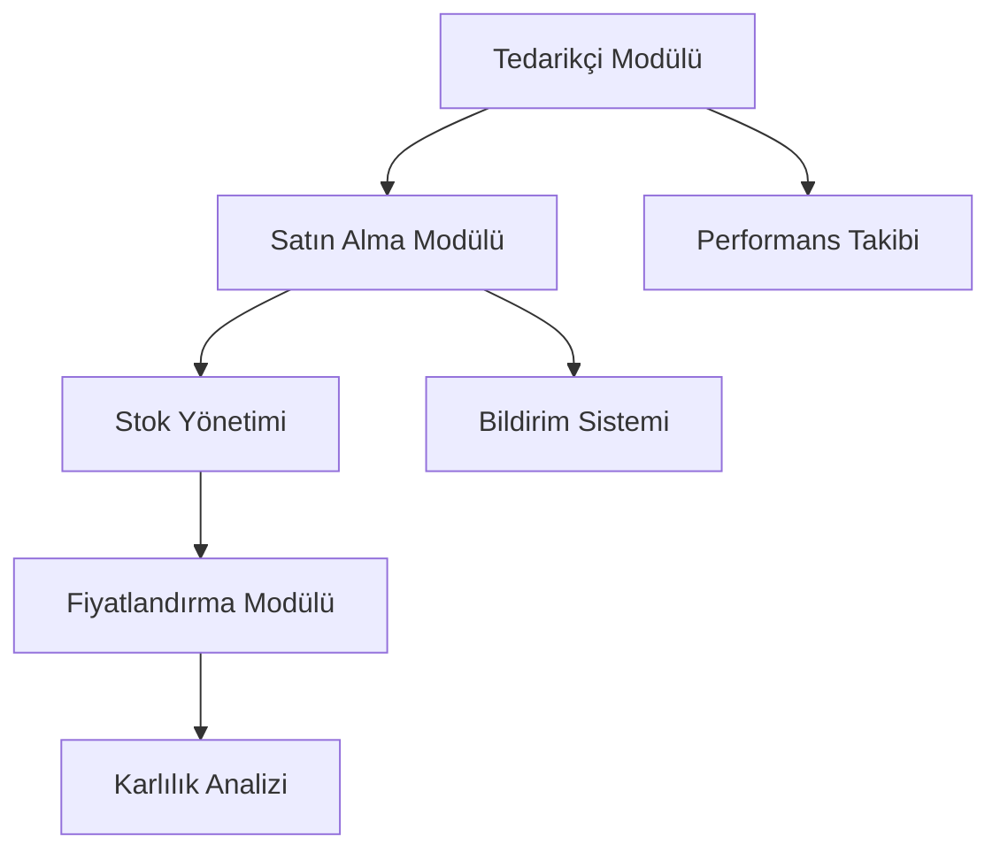
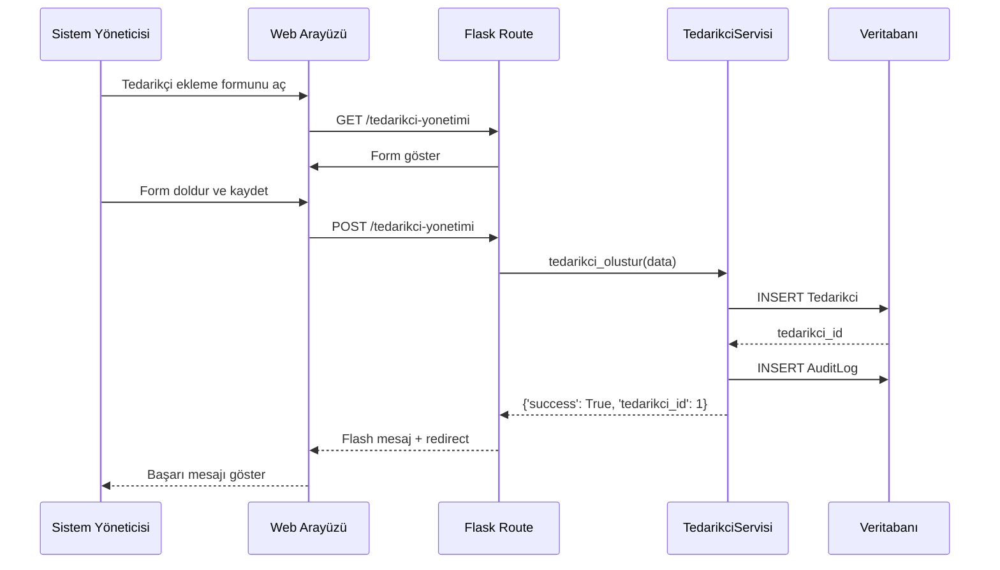
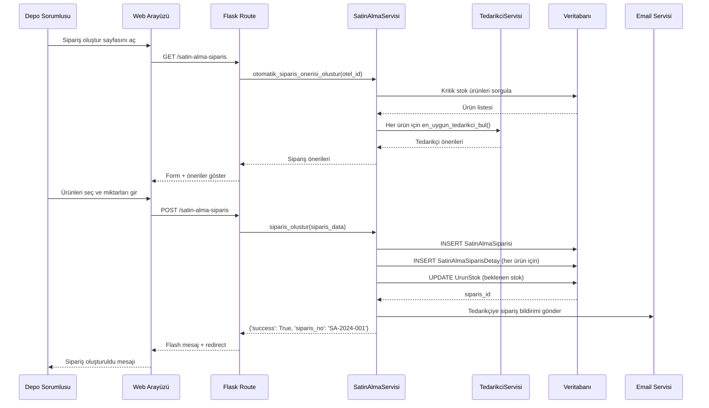
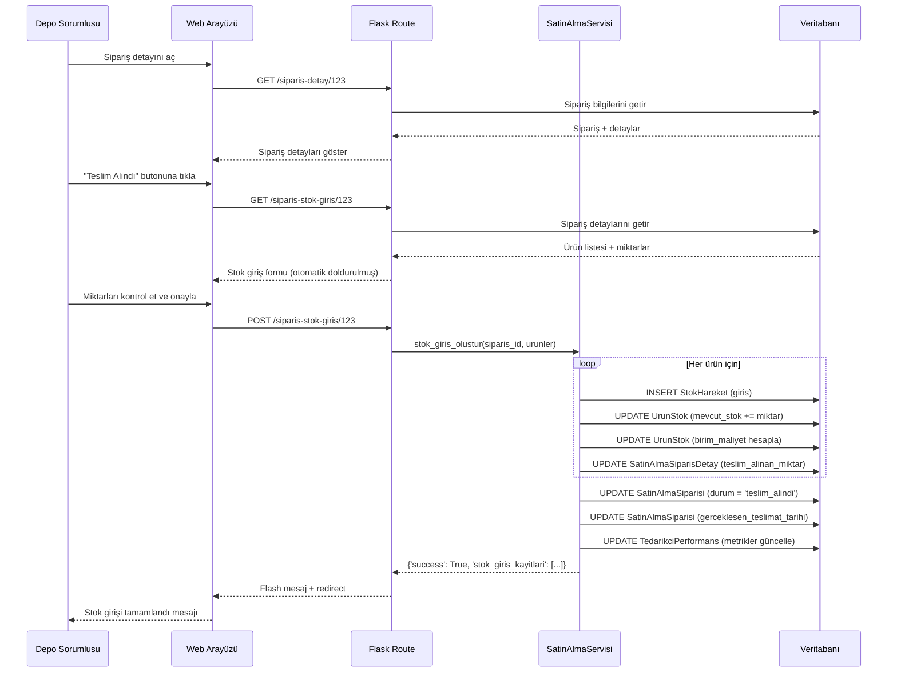

# Tedarikçi ve Satın Alma Modülü - Tasarım Dokümanı

## Genel Bakış

Bu modül, otel minibar yönetim sistemine tedarikçi yönetimi ve satın alma süreçlerini entegre eder. Mevcut stok yönetimi ve fiyatlandırma modülleriyle sıkı entegrasyon sağlayarak, karlılık hesaplamalarının doğru yapılmasını ve stok kesintilerinin önlenmesini hedefler.

### Temel Hedefler

1. **Tedarikçi Yönetimi**: Tedarikçi bilgilerinin merkezi yönetimi
2. **Satın Alma Otomasyonu**: Kritik stok seviyelerinde otomatik sipariş önerileri
3. **Fiyat Optimizasyonu**: Tedarikçiler arası fiyat karşılaştırması ve en uygun seçim
4. **Stok Entegrasyonu**: Satın alma ile stok girişinin otomatik entegrasyonu
5. **Performans Takibi**: Tedarikçi performans metrikleri ve raporlama

## Mimari

### Katmanlı Mimari

```
┌─────────────────────────────────────────────────────────────┐
│                    Sunum Katmanı (UI)                        │
│  ┌──────────────────┐  ┌──────────────────┐                │
│  │ Sistem Yöneticisi│  │ Depo Sorumlusu   │                │
│  │ Paneli           │  │ Paneli           │                │
│  └──────────────────┘  └──────────────────┘                │
└─────────────────────────────────────────────────────────────┘
                            ↓
┌─────────────────────────────────────────────────────────────┐
│                    İş Mantığı Katmanı                        │
│  ┌──────────────────┐  ┌──────────────────┐                │
│  │ Tedarikçi        │  │ Satın Alma       │                │
│  │ Servisleri       │  │ Servisleri       │                │
│  └──────────────────┘  └──────────────────┘                │
│  ┌──────────────────┐  ┌──────────────────┐                │
│  │ Fiyat Yönetimi   │  │ Sipariş Takibi   │                │
│  └──────────────────┘  └──────────────────┘                │
└─────────────────────────────────────────────────────────────┘
                            ↓
┌─────────────────────────────────────────────────────────────┐
│                    Veri Erişim Katmanı                       │
│  ┌──────────────────┐  ┌──────────────────┐                │
│  │ SQLAlchemy ORM   │  │ Cache Manager    │                │
│  └──────────────────┘  └──────────────────┘                │
└─────────────────────────────────────────────────────────────┘
                            ↓
┌─────────────────────────────────────────────────────────────┐
│                    Veri Katmanı                              │
│  PostgreSQL Database                                         │
└─────────────────────────────────────────────────────────────┘
```

### Modül Entegrasyonu



## Bileşenler ve Arayüzler

### 1. Veri Modelleri

#### 1.1 Mevcut Modeller (Kullanılacak)

```python
# models.py - Zaten mevcut
class Tedarikci(db.Model):
    """Tedarikçi bilgileri"""
    id, tedarikci_adi, iletisim_bilgileri, vergi_no, aktif

class UrunTedarikciFiyat(db.Model):
    """Ürün-tedarikçi fiyat ilişkisi"""
    id, urun_id, tedarikci_id, alis_fiyati, minimum_miktar
    baslangic_tarihi, bitis_tarihi, aktif

class UrunStok(db.Model):
    """Ürün stok durumu"""
    id, urun_id, otel_id, mevcut_stok, minimum_stok
    kritik_stok_seviyesi, birim_maliyet
```

#### 1.2 Yeni Modeller (Eklenecek)

```python
class SatinAlmaSiparisi(db.Model):
    """Satın alma siparişi ana tablosu"""
    __tablename__ = 'satin_alma_siparisleri'

    id = db.Column(db.Integer, primary_key=True)
    siparis_no = db.Column(db.String(50), unique=True, nullable=False)
    tedarikci_id = db.Column(db.Integer, db.ForeignKey('tedarikciler.id'))
    otel_id = db.Column(db.Integer, db.ForeignKey('oteller.id'))
    siparis_tarihi = db.Column(db.DateTime(timezone=True))
    tahmini_teslimat_tarihi = db.Column(db.Date)
    gerceklesen_teslimat_tarihi = db.Column(db.Date, nullable=True)
    durum = db.Column(db.Enum(SiparisDurum))  # beklemede, onaylandi, teslim_alindi, iptal
    toplam_tutar = db.Column(Numeric(12, 2))
    aciklama = db.Column(db.Text)
    olusturan_id = db.Column(db.Integer, db.ForeignKey('kullanicilar.id'))
    onaylayan_id = db.Column(db.Integer, db.ForeignKey('kullanicilar.id'))

    # İlişkiler
    tedarikci = db.relationship('Tedarikci')
    otel = db.relationship('Otel')
    detaylar = db.relationship('SatinAlmaSiparisDetay', cascade='all, delete-orphan')
    olusturan = db.relationship('Kullanici', foreign_keys=[olusturan_id])
    onaylayan = db.relationship('Kullanici', foreign_keys=[onaylayan_id])

class SatinAlmaSiparisDetay(db.Model):
    """Sipariş detay satırları"""
    __tablename__ = 'satin_alma_siparis_detaylari'

    id = db.Column(db.Integer, primary_key=True)
    siparis_id = db.Column(db.Integer, db.ForeignKey('satin_alma_siparisleri.id'))
    urun_id = db.Column(db.Integer, db.ForeignKey('urunler.id'))
    miktar = db.Column(db.Integer, nullable=False)
    birim_fiyat = db.Column(Numeric(10, 2), nullable=False)
    toplam_fiyat = db.Column(Numeric(12, 2))
    teslim_alinan_miktar = db.Column(db.Integer, default=0)

    # İlişkiler
    urun = db.relationship('Urun')
    siparis = db.relationship('SatinAlmaSiparisi')

class TedarikciPerformans(db.Model):
    """Tedarikçi performans metrikleri"""
    __tablename__ = 'tedarikci_performans'

    id = db.Column(db.Integer, primary_key=True)
    tedarikci_id = db.Column(db.Integer, db.ForeignKey('tedarikciler.id'))
    donem_baslangic = db.Column(db.Date, nullable=False)
    donem_bitis = db.Column(db.Date, nullable=False)
    toplam_siparis_sayisi = db.Column(db.Integer, default=0)
    zamaninda_teslimat_sayisi = db.Column(db.Integer, default=0)
    ortalama_teslimat_suresi = db.Column(db.Integer)  # Gün cinsinden
    toplam_siparis_tutari = db.Column(Numeric(12, 2))
    performans_skoru = db.Column(Numeric(5, 2))  # 0-100 arası

    # İlişkiler
    tedarikci = db.relationship('Tedarikci')

class TedarikciIletisim(db.Model):
    """Tedarikçi iletişim kayıtları"""
    __tablename__ = 'tedarikci_iletisim'

    id = db.Column(db.Integer, primary_key=True)
    tedarikci_id = db.Column(db.Integer, db.ForeignKey('tedarikciler.id'))
    siparis_id = db.Column(db.Integer, db.ForeignKey('satin_alma_siparisleri.id'))
    iletisim_tarihi = db.Column(db.DateTime(timezone=True))
    konu = db.Column(db.String(200))
    aciklama = db.Column(db.Text)
    kullanici_id = db.Column(db.Integer, db.ForeignKey('kullanicilar.id'))

    # İlişkiler
    tedarikci = db.relationship('Tedarikci')
    siparis = db.relationship('SatinAlmaSiparisi')
    kullanici = db.relationship('Kullanici')

class TedarikciDokuman(db.Model):
    """Tedarikçi belge yönetimi"""
    __tablename__ = 'tedarikci_dokumanlar'

    id = db.Column(db.Integer, primary_key=True)
    tedarikci_id = db.Column(db.Integer, db.ForeignKey('tedarikciler.id'))
    siparis_id = db.Column(db.Integer, db.ForeignKey('satin_alma_siparisleri.id'))
    dokuman_tipi = db.Column(db.Enum(DokumanTipi))  # fatura, irsaliye, sozlesme, diger
    dosya_adi = db.Column(db.String(255))
    dosya_yolu = db.Column(db.String(500))
    dosya_boyutu = db.Column(db.Integer)  # Bytes
    yuklenme_tarihi = db.Column(db.DateTime(timezone=True))
    yuklenen_kullanici_id = db.Column(db.Integer, db.ForeignKey('kullanicilar.id'))

    # İlişkiler
    tedarikci = db.relationship('Tedarikci')
    siparis = db.relationship('SatinAlmaSiparisi')
    yuklenen_kullanici = db.relationship('Kullanici')
```

### 2. Servis Katmanı

#### 2.1 TedarikciServisi

```python
# utils/tedarikci_servisleri.py

class TedarikciServisi:
    """Tedarikçi yönetim servisleri"""

    @staticmethod
    def tedarikci_olustur(tedarikci_data: Dict, kullanici_id: int) -> Dict:
        """
        Yeni tedarikçi oluştur

        Args:
            tedarikci_data: {
                'tedarikci_adi': str,
                'telefon': str,
                'email': str,
                'adres': str,
                'vergi_no': str,
                'odeme_kosullari': str
            }
            kullanici_id: İşlemi yapan kullanıcı

        Returns:
            dict: {'success': bool, 'tedarikci_id': int, 'message': str}
        """

    @staticmethod
    def tedarikci_guncelle(tedarikci_id: int, tedarikci_data: Dict) -> bool:
        """Tedarikçi bilgilerini güncelle"""

    @staticmethod
    def tedarikci_listele(aktif: Optional[bool] = True) -> List[Dict]:
        """Tedarikçileri listele"""

    @staticmethod
    def tedarikci_performans_hesapla(tedarikci_id: int, donem_baslangic: date, donem_bitis: date) -> Dict:
        """
        Tedarikçi performans metriklerini hesapla

        Returns:
            dict: {
                'toplam_siparis': int,
                'zamaninda_teslimat_orani': float,
                'ortalama_teslimat_suresi': int,
                'performans_skoru': float
            }
        """

    @staticmethod
    def en_uygun_tedarikci_bul(urun_id: int, miktar: int) -> Optional[Dict]:
        """
        Ürün için en uygun tedarikçiyi bul (fiyat + performans)

        Returns:
            dict: {
                'tedarikci_id': int,
                'tedarikci_adi': str,
                'birim_fiyat': Decimal,
                'toplam_fiyat': Decimal,
                'performans_skoru': float,
                'tahmini_teslimat_suresi': int
            }
        """
```

#### 2.2 SatinAlmaServisi

```python
# utils/satin_alma_servisleri.py

class SatinAlmaServisi:
    """Satın alma yönetim servisleri"""

    @staticmethod
    def siparis_olustur(siparis_data: Dict, kullanici_id: int) -> Dict:
        """
        Yeni satın alma siparişi oluştur

        Args:
            siparis_data: {
                'tedarikci_id': int,
                'otel_id': int,
                'urunler': [
                    {'urun_id': int, 'miktar': int, 'birim_fiyat': Decimal}
                ],
                'tahmini_teslimat_tarihi': date,
                'aciklama': str
            }
            kullanici_id: Siparişi oluşturan kullanıcı

        Returns:
            dict: {
                'success': bool,
                'siparis_id': int,
                'siparis_no': str,
                'toplam_tutar': Decimal,
                'message': str
            }
        """

    @staticmethod
    def siparis_durum_guncelle(siparis_id: int, yeni_durum: str, kullanici_id: int) -> bool:
        """Sipariş durumunu güncelle"""

    @staticmethod
    def siparis_listele(otel_id: Optional[int] = None, durum: Optional[str] = None) -> List[Dict]:
        """Siparişleri filtrele ve listele"""

    @staticmethod
    def otomatik_siparis_onerisi_olustur(otel_id: int) -> List[Dict]:
        """
        Kritik stok seviyesindeki ürünler için sipariş önerisi oluştur

        Returns:
            list: [
                {
                    'urun_id': int,
                    'urun_adi': str,
                    'mevcut_stok': int,
                    'kritik_seviye': int,
                    'onerilen_miktar': int,
                    'tahmini_tuketim': int,
                    'en_uygun_tedarikci': dict
                }
            ]
        """

    @staticmethod
    def stok_giris_olustur(siparis_id: int, teslim_alinan_urunler: List[Dict], kullanici_id: int) -> Dict:
        """
        Sipariş teslimatından stok girişi oluştur

        Args:
            siparis_id: Sipariş ID
            teslim_alinan_urunler: [
                {'urun_id': int, 'miktar': int}
            ]
            kullanici_id: İşlemi yapan kullanıcı

        Returns:
            dict: {
                'success': bool,
                'stok_giris_kayitlari': list,
                'siparis_durumu': str,
                'message': str
            }
        """

    @staticmethod
    def geciken_siparisler_kontrol() -> List[Dict]:
        """Tahmini teslimat tarihi geçmiş siparişleri bul"""
```

### 3. Route Yapısı

#### 3.1 Sistem Yöneticisi Routes

```python
# routes/sistem_yoneticisi_routes.py

@app.route('/tedarikci-yonetimi', methods=['GET', 'POST'])
@login_required
@role_required('sistem_yoneticisi')
def tedarikci_yonetimi():
    """Tedarikçi tanımlama ve listeleme"""

@app.route('/tedarikci-duzenle/<int:tedarikci_id>', methods=['GET', 'POST'])
@login_required
@role_required('sistem_yoneticisi')
def tedarikci_duzenle(tedarikci_id):
    """Tedarikçi bilgilerini düzenle"""

@app.route('/tedarikci-performans/<int:tedarikci_id>')
@login_required
@role_required('sistem_yoneticisi')
def tedarikci_performans(tedarikci_id):
    """Tedarikçi performans raporu"""

@app.route('/urun-tedarikci-fiyat', methods=['GET', 'POST'])
@login_required
@role_required('sistem_yoneticisi')
def urun_tedarikci_fiyat():
    """Ürün-tedarikçi fiyat tanımlama"""

@app.route('/fiyat-karsilastirma/<int:urun_id>')
@login_required
@role_required('sistem_yoneticisi')
def fiyat_karsilastirma(urun_id):
    """Ürün için tedarikçi fiyat karşılaştırması"""
```

#### 3.2 Depo Sorumlusu Routes

```python
# routes/depo_sorumlusu_routes.py

@app.route('/satin-alma-siparis', methods=['GET', 'POST'])
@login_required
@role_required('depo_sorumlusu')
def satin_alma_siparis():
    """Satın alma siparişi oluştur"""

@app.route('/siparis-listesi')
@login_required
@role_required('depo_sorumlusu')
def siparis_listesi():
    """Sipariş listesi ve takip"""

@app.route('/siparis-detay/<int:siparis_id>')
@login_required
@role_required('depo_sorumlusu')
def siparis_detay(siparis_id):
    """Sipariş detayları ve durum güncelleme"""

@app.route('/siparis-stok-giris/<int:siparis_id>', methods=['GET', 'POST'])
@login_required
@role_required('depo_sorumlusu')
def siparis_stok_giris(siparis_id):
    """Sipariş teslimatından stok girişi"""

@app.route('/otomatik-siparis-onerileri')
@login_required
@role_required('depo_sorumlusu')
def otomatik_siparis_onerileri():
    """Kritik stok için otomatik sipariş önerileri"""

@app.route('/tedarikci-iletisim/<int:tedarikci_id>', methods=['GET', 'POST'])
@login_required
@role_required('depo_sorumlusu')
def tedarikci_iletisim(tedarikci_id):
    """Tedarikçi iletişim kayıtları"""

@app.route('/toplu-siparis-yukle', methods=['GET', 'POST'])
@login_required
@role_required('depo_sorumlusu')
def toplu_siparis_yukle():
    """Excel ile toplu sipariş yükleme"""
```

### 4. Form Yapıları

```python
# forms.py

class TedarikciForm(FlaskForm):
    """Tedarikçi tanımlama formu"""
    tedarikci_adi = StringField('Tedarikçi Adı', validators=[DataRequired(), Length(max=200)])
    telefon = StringField('Telefon', validators=[DataRequired(), Length(max=20)])
    email = StringField('E-posta', validators=[Optional(), Email(), Length(max=100)])
    adres = TextAreaField('Adres', validators=[Optional(), Length(max=500)])
    vergi_no = StringField('Vergi No', validators=[Optional(), Length(max=50)])
    odeme_kosullari = TextAreaField('Ödeme Koşulları', validators=[Optional()])
    aktif = BooleanField('Aktif', default=True)

class UrunTedarikciFiyatForm(FlaskForm):
    """Ürün-tedarikçi fiyat formu"""
    urun_id = SelectField('Ürün', coerce=int, validators=[DataRequired()])
    tedarikci_id = SelectField('Tedarikçi', coerce=int, validators=[DataRequired()])
    alis_fiyati = DecimalField('Alış Fiyatı', validators=[DataRequired(), NumberRange(min=0)])
    minimum_miktar = IntegerField('Minimum Sipariş Miktarı', validators=[DataRequired(), NumberRange(min=1)])
    baslangic_tarihi = DateField('Başlangıç Tarihi', validators=[DataRequired()])
    bitis_tarihi = DateField('Bitiş Tarihi', validators=[Optional()])
    aktif = BooleanField('Aktif', default=True)

class SatinAlmaSiparisForm(FlaskForm):
    """Satın alma siparişi formu"""
    tedarikci_id = SelectField('Tedarikçi', coerce=int, validators=[DataRequired()])
    tahmini_teslimat_tarihi = DateField('Tahmini Teslimat Tarihi', validators=[DataRequired()])
    aciklama = TextAreaField('Açıklama', validators=[Optional()])
    # Dinamik ürün satırları JavaScript ile eklenir

class SiparisStokGirisForm(FlaskForm):
    """Sipariş stok giriş formu"""
    gerceklesen_teslimat_tarihi = DateField('Teslimat Tarihi', validators=[DataRequired()])
    aciklama = TextAreaField('Açıklama', validators=[Optional()])
    # Ürün miktarları dinamik olarak eklenir

class TedarikciIletisimForm(FlaskForm):
    """Tedarikçi iletişim formu"""
    siparis_id = SelectField('İlgili Sipariş', coerce=int, validators=[Optional()])
    konu = StringField('Konu', validators=[DataRequired(), Length(max=200)])
    aciklama = TextAreaField('Açıklama', validators=[DataRequired()])
    iletisim_tarihi = DateTimeField('İletişim Tarihi', validators=[DataRequired()])
```

## Veri Akışları

### 1. Tedarikçi Tanımlama Akışı



### 2. Satın Alma Siparişi Oluşturma Akışı



### 3. Stok Giriş Entegrasyonu Akışı



## Hata Yönetimi

### 1. Validasyon Hataları

```python
class SatinAlmaValidasyonHatalari:
    """Satın alma modülü validasyon hataları"""

    TEDARIKCI_BULUNAMADI = "Belirtilen tedarikçi bulunamadı"
    URUN_BULUNAMADI = "Belirtilen ürün bulunamadı"
    MINIMUM_MIKTAR_HATASI = "Sipariş miktarı minimum sipariş miktarından az olamaz"
    GECERSIZ_FIYAT = "Geçersiz fiyat değeri"
    GECERSIZ_TARIH = "Geçersiz tarih değeri"
    AKTIF_SIPARIS_VAR = "Tedarikçinin aktif siparişi bulunmaktadır, pasif yapılamaz"
    STOK_GIRIS_HATASI = "Stok giriş işlemi sırasında hata oluştu"
    DOSYA_YUKLEME_HATASI = "Dosya yükleme işlemi başarısız"
    EXCEL_FORMAT_HATASI = "Excel dosya formatı hatalı"
```

### 2. İş Mantığı Hataları

```python
try:
    # Sipariş oluşturma
    siparis = SatinAlmaServisi.siparis_olustur(siparis_data, kullanici_id)
except TedarikciPasifHatasi as e:
    flash('Seçilen tedarikçi pasif durumda, sipariş oluşturulamaz', 'danger')
except MinimumMiktarHatasi as e:
    flash(f'Minimum sipariş miktarı: {e.minimum_miktar}', 'warning')
except StokGuncellemHatasi as e:
    db.session.rollback()
    flash('Stok güncelleme hatası, işlem geri alındı', 'danger')
    log_hata(e, modul='satin_alma')
except Exception as e:
    db.session.rollback()
    flash('Beklenmeyen bir hata oluştu', 'danger')
    log_hata(e, modul='satin_alma')
```

### 3. Veritabanı Hataları

```python
from sqlalchemy.exc import IntegrityError, OperationalError

try:
    db.session.commit()
except IntegrityError as e:
    db.session.rollback()
    if 'unique constraint' in str(e).lower():
        flash('Bu kayıt zaten mevcut', 'danger')
    elif 'foreign key' in str(e).lower():
        flash('İlişkili kayıt bulunamadı', 'danger')
    else:
        flash('Veritabanı kısıtlama hatası', 'danger')
except OperationalError as e:
    db.session.rollback()
    flash('Veritabanı bağlantı hatası', 'danger')
    log_hata(e, modul='database')
```

## Test Stratejisi

### 1. Birim Testleri

````python
# tests/test_tedarikci_servisleri.py

class TestTedarikciServisi(unittest.TestCase):
    """Tedarikçi servisleri birim testleri"""

    def test_tedarikci_olustur_basarili(self):
        """Geçerli verilerle tedarikçi oluşturma testi"""

    def test_tedarikci_olustur_eksik_veri(self):
        """Eks
```ik verilerle tedarikçi oluşturma hatası testi"""

    def test_en_uygun_tedarikci_bul(self):
        """En uygun tedarikçi bulma algoritması testi"""

    def test_performans_skoru_hesaplama(self):
        """Tedarikçi performans skoru hesaplama testi"""

# tests/test_satin_alma_servisleri.py

class TestSatinAlmaServisi(unittest.TestCase):
    """Satın alma servisleri birim testleri"""

    def test_siparis_olustur_basarili(self):
        """Geçerli verilerle sipariş oluşturma testi"""

    def test_siparis_olustur_minimum_miktar_hatasi(self):
        """Minimum miktar kontrolü testi"""

    def test_otomatik_siparis_onerisi(self):
        """Otomatik sipariş önerisi algoritması testi"""

    def test_stok_giris_entegrasyonu(self):
        """Stok giriş entegrasyonu testi"""

    def test_kısmi_teslimat(self):
        """Kısmi teslimat senaryosu testi"""
````

### 2. Entegrasyon Testleri

```python
# tests/test_satin_alma_entegrasyon.py

class TestSatinAlmaEntegrasyon(unittest.TestCase):
    """Satın alma modülü entegrasyon testleri"""

    def test_siparis_stok_giris_akisi(self):
        """Sipariş oluşturma -> Stok giriş tam akış testi"""
        # 1. Sipariş oluştur
        # 2. Sipariş durumunu güncelle
        # 3. Stok girişi yap
        # 4. Stok seviyelerini kontrol et
        # 5. Tedarikçi performansını kontrol et

    def test_fiyatlandirma_entegrasyonu(self):
        """Tedarikçi fiyatı -> Karlılık hesaplama entegrasyonu"""
        # 1. Tedarikçi fiyatı tanımla
        # 2. Stok girişi yap
        # 3. Birim maliyet güncellemesini kontrol et
        # 4. Karlılık hesaplamasını kontrol et

    def test_otomatik_siparis_onerisi_akisi(self):
        """Kritik stok -> Otomatik öneri -> Sipariş oluşturma akışı"""
```

### 3. UI Testleri

```python
# tests/test_tedarikci_ui.py

class TestTedarikciUI(unittest.TestCase):
    """Tedarikçi yönetimi UI testleri"""

    def test_tedarikci_listesi_goruntulenme(self):
        """Tedarikçi listesi sayfası render testi"""

    def test_tedarikci_ekleme_formu(self):
        """Tedarikçi ekleme formu submit testi"""

    def test_fiyat_karsilastirma_tablosu(self):
        """Fiyat karşılaştırma tablosu render testi"""
```

## Güvenlik Önlemleri

### 1. Yetkilendirme

```python
# Rol bazlı erişim kontrolü
@app.route('/tedarikci-yonetimi')
@login_required
@role_required('sistem_yoneticisi')  # Sadece sistem yöneticisi
def tedarikci_yonetimi():
    pass

@app.route('/satin-alma-siparis')
@login_required
@role_required('depo_sorumlusu', 'sistem_yoneticisi')  # Depo sorumlusu veya sistem yöneticisi
def satin_alma_siparis():
    pass

# Otel bazlı veri izolasyonu
def get_user_oteller(kullanici_id):
    """Kullanıcının erişebileceği otelleri getir"""
    kullanici = Kullanici.query.get(kullanici_id)
    if kullanici.rol == 'sistem_yoneticisi':
        return Otel.query.all()
    elif kullanici.rol == 'depo_sorumlusu':
        return [atama.otel for atama in kullanici.atanan_oteller]
    return []
```

### 2. Input Validasyonu

```python
# SQL Injection koruması (SQLAlchemy ORM kullanımı)
# XSS koruması (Flask template auto-escaping)
# CSRF koruması (Flask-WTF)

class TedarikciForm(FlaskForm):
    """CSRF token otomatik eklenir"""
    class Meta:
        csrf = True

# Dosya yükleme güvenliği
ALLOWED_EXTENSIONS = {'pdf', 'xlsx', 'xls', 'jpg', 'jpeg', 'png'}
MAX_FILE_SIZE = 10 * 1024 * 1024  # 10 MB

def allowed_file(filename):
    return '.' in filename and \
           filename.rsplit('.', 1)[1].lower() in ALLOWED_EXTENSIONS

def secure_file_upload(file):
    if file and allowed_file(file.filename):
        filename = secure_filename(file.filename)
        # Dosya boyutu kontrolü
        file.seek(0, os.SEEK_END)
        file_length = file.tell()
        if file_length > MAX_FILE_SIZE:
            raise ValueError('Dosya boyutu çok büyük')
        file.seek(0)
        return filename
    raise ValueError('Geçersiz dosya formatı')
```

### 3. Audit Trail

```python
# Her kritik işlem için audit kaydı
from utils.audit import audit_create, audit_update, audit_delete

# Tedarikçi oluşturma
tedarikci = Tedarikci(...)
db.session.add(tedarikci)
db.session.commit()
audit_create('tedarikci', tedarikci.id, tedarikci)

# Sipariş güncelleme
eski_deger = serialize_model(siparis)
siparis.durum = 'onaylandi'
db.session.commit()
audit_update('satin_alma_siparisi', siparis.id, eski_deger, siparis)

# Fiyat değişikliği
fiyat_gecmisi = UrunFiyatGecmisi(
    urun_id=urun_id,
    eski_fiyat=eski_fiyat,
    yeni_fiyat=yeni_fiyat,
    degisiklik_tipi='alis_fiyati',
    olusturan_id=kullanici_id
)
db.session.add(fiyat_gecmisi)
```

## Performans Optimizasyonu

### 1. Veritabanı İndeksleri

```python
# models.py - İndeks tanımlamaları

class SatinAlmaSiparisi(db.Model):
    __table_args__ = (
        db.Index('idx_siparis_durum_tarih', 'durum', 'siparis_tarihi'),
        db.Index('idx_siparis_tedarikci', 'tedarikci_id'),
        db.Index('idx_siparis_otel', 'otel_id'),
    )

class UrunTedarikciFiyat(db.Model):
    __table_args__ = (
        db.Index('idx_urun_tedarikci_aktif', 'urun_id', 'tedarikci_id', 'aktif'),
        db.Index('idx_fiyat_tarih', 'baslangic_tarihi', 'bitis_tarihi'),
    )
```

### 2. Sorgu Optimizasyonu

```python
# Eager loading ile N+1 sorgu problemini önleme
siparisler = SatinAlmaSiparisi.query\
    .options(
        db.joinedload(SatinAlmaSiparisi.tedarikci),
        db.joinedload(SatinAlmaSiparisi.detaylar).joinedload(SatinAlmaSiparisDetay.urun)
    )\
    .filter_by(otel_id=otel_id)\
    .all()

# Pagination ile büyük veri setlerini yönetme
page = request.args.get('page', 1, type=int)
per_page = 20
siparisler = SatinAlmaSiparisi.query\
    .filter_by(otel_id=otel_id)\
    .order_by(SatinAlmaSiparisi.siparis_tarihi.desc())\
    .paginate(page=page, per_page=per_page, error_out=False)
```

### 3. Cache Kullanımı

```python
from utils.cache_manager import cache

@cache.memoize(timeout=300)  # 5 dakika cache
def get_tedarikci_performans(tedarikci_id, donem_baslangic, donem_bitis):
    """Tedarikçi performans metriklerini cache'le"""
    return TedarikciServisi.tedarikci_performans_hesapla(
        tedarikci_id, donem_baslangic, donem_bitis
    )

# Cache invalidation
def siparis_durum_guncelle(siparis_id, yeni_durum):
    siparis = SatinAlmaSiparisi.query.get(siparis_id)
    siparis.durum = yeni_durum
    db.session.commit()

    # Tedarikçi performans cache'ini temizle
    cache.delete_memoized(get_tedarikci_performans, siparis.tedarikci_id)
```

## Bildirim Sistemi

### 1. Email Bildirimleri

```python
# utils/email_servisi.py

class EmailServisi:
    """Email bildirim servisi"""

    @staticmethod
    def siparis_bildirimi_gonder(siparis_id: int):
        """Tedarikçiye sipariş bildirimi gönder"""
        siparis = SatinAlmaSiparisi.query.get(siparis_id)
        tedarikci = siparis.tedarikci

        if not tedarikci.iletisim_bilgileri.get('email'):
            return False

        subject = f"Yeni Sipariş: {siparis.siparis_no}"
        body = render_template('emails/siparis_bildirimi.html', siparis=siparis)

        send_email(
            to=tedarikci.iletisim_bilgileri['email'],
            subject=subject,
            body=body
        )

    @staticmethod
    def gecikme_uyarisi_gonder(siparis_id: int):
        """Sipariş gecikmesi için uyarı gönder"""
        siparis = SatinAlmaSiparisi.query.get(siparis_id)
        depo_sorumlusu = siparis.olusturan

        subject = f"Sipariş Gecikme Uyarısı: {siparis.siparis_no}"
        body = render_template('emails/gecikme_uyarisi.html', siparis=siparis)

        send_email(
            to=depo_sorumlusu.email,
            subject=subject,
            body=body
        )
```

### 2. Dashboard Bildirimleri

```python
# Dashboard'da gösterilecek bildirimler
def get_dashboard_bildirimleri(kullanici_id):
    """Kullanıcı için dashboard bildirimlerini getir"""
    bildirimler = []

    # Kritik stok uyarıları
    kritik_stoklar = UrunStok.query.filter(
        UrunStok.mevcut_stok <= UrunStok.kritik_stok_seviyesi
    ).count()
    if kritik_stoklar > 0:
        bildirimler.append({
            'tip': 'warning',
            'mesaj': f'{kritik_stoklar} ürün kritik stok seviyesinde',
            'link': url_for('otomatik_siparis_onerileri')
        })

    # Geciken siparişler
    geciken_siparisler = SatinAlmaServisi.geciken_siparisler_kontrol()
    if geciken_siparisler:
        bildirimler.append({
            'tip': 'danger',
            'mesaj': f'{len(geciken_siparisler)} sipariş gecikmede',
            'link': url_for('siparis_listesi', durum='geciken')
        })

    # Onay bekleyen siparişler
    bekleyen_siparisler = SatinAlmaSiparisi.query.filter_by(
        durum='beklemede'
    ).count()
    if bekleyen_siparisler > 0:
        bildirimler.append({
            'tip': 'info',
            'mesaj': f'{bekleyen_siparisler} sipariş onay bekliyor',
            'link': url_for('siparis_listesi', durum='beklemede')
        })

    return bildirimler
```

## Raporlama

### 1. Tedarikçi Performans Raporu

```python
def tedarikci_performans_raporu(tedarikci_id, donem_baslangic, donem_bitis):
    """Tedarikçi performans raporu oluştur"""

    # Temel metrikler
    siparisler = SatinAlmaSiparisi.query.filter(
        SatinAlmaSiparisi.tedarikci_id == tedarikci_id,
        SatinAlmaSiparisi.siparis_tarihi.between(donem_baslangic, donem_bitis)
    ).all()

    toplam_siparis = len(siparisler)
    zamaninda_teslimat = sum(1 for s in siparisler
                             if s.gerceklesen_teslimat_tarihi
                             and s.gerceklesen_teslimat_tarihi <= s.tahmini_teslimat_tarihi)

    ortalama_teslimat_suresi = calculate_average_delivery_time(siparisler)
    toplam_tutar = sum(s.toplam_tutar for s in siparisler)

    # Performans skoru hesaplama
    zamaninda_oran = (zamaninda_teslimat / toplam_siparis * 100) if toplam_siparis > 0 else 0
    performans_skoru = calculate_performance_score(zamaninda_oran, ortalama_teslimat_suresi)

    return {
        'toplam_siparis': toplam_siparis,
        'zamaninda_teslimat': zamaninda_teslimat,
        'zamaninda_oran': zamaninda_oran,
        'ortalama_teslimat_suresi': ortalama_teslimat_suresi,
        'toplam_tutar': toplam_tutar,
        'performans_skoru': performans_skoru
    }
```

### 2. Satın Alma Özet Raporu

```python
def satin_alma_ozet_raporu(otel_id, donem_baslangic, donem_bitis):
    """Dönemsel satın alma özet raporu"""

    siparisler = SatinAlmaSiparisi.query.filter(
        SatinAlmaSiparisi.otel_id == otel_id,
        SatinAlmaSiparisi.siparis_tarihi.between(donem_baslangic, donem_bitis)
    ).all()

    # Tedarikçi bazında analiz
    tedarikci_analiz = {}
    for siparis in siparisler:
        tedarikci_id = siparis.tedarikci_id
        if tedarikci_id not in tedarikci_analiz:
            tedarikci_analiz[tedarikci_id] = {
                'tedarikci_adi': siparis.tedarikci.tedarikci_adi,
                'siparis_sayisi': 0,
                'toplam_tutar': Decimal('0')
            }
        tedarikci_analiz[tedarikci_id]['siparis_sayisi'] += 1
        tedarikci_analiz[tedarikci_id]['toplam_tutar'] += siparis.toplam_tutar

    # Ürün bazında analiz
    urun_analiz = {}
    for siparis in siparisler:
        for detay in siparis.detaylar:
            urun_id = detay.urun_id
            if urun_id not in urun_analiz:
                urun_analiz[urun_id] = {
                    'urun_adi': detay.urun.urun_adi,
                    'toplam_miktar': 0,
                    'toplam_tutar': Decimal('0')
                }
            urun_analiz[urun_id]['toplam_miktar'] += detay.miktar
            urun_analiz[urun_id]['toplam_tutar'] += detay.toplam_fiyat

    return {
        'toplam_siparis': len(siparisler),
        'toplam_tutar': sum(s.toplam_tutar for s in siparisler),
        'tedarikci_analiz': tedarikci_analiz,
        'urun_analiz': urun_analiz
    }
```
