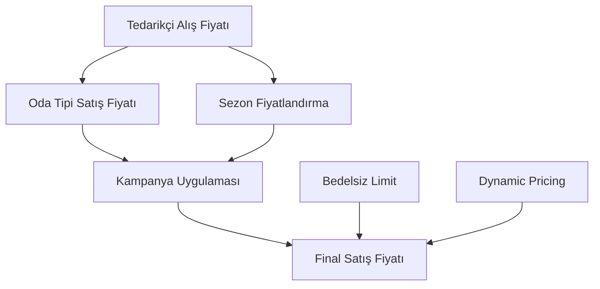
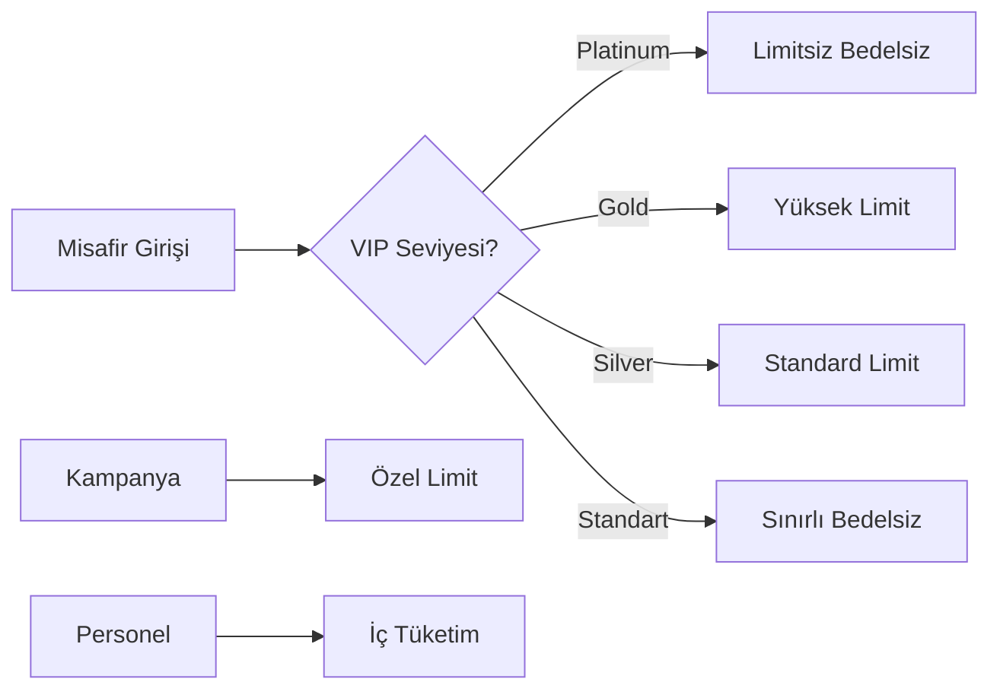
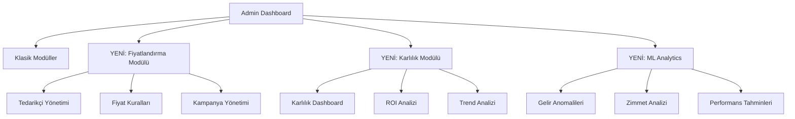
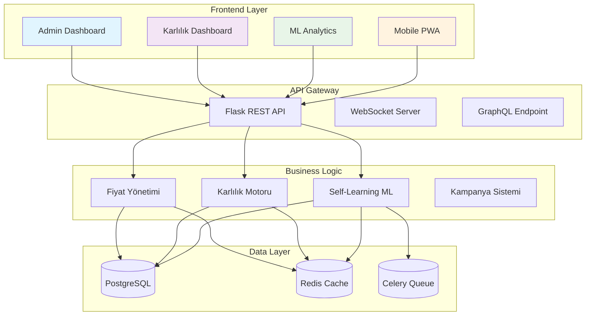
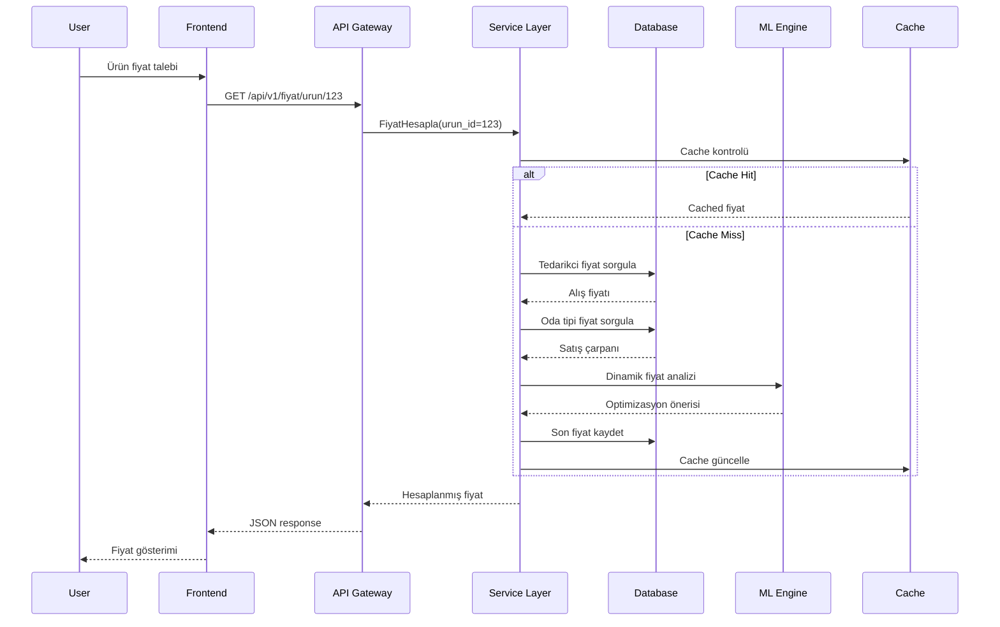
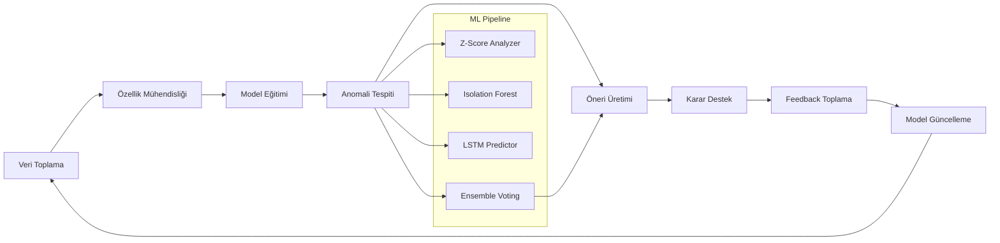
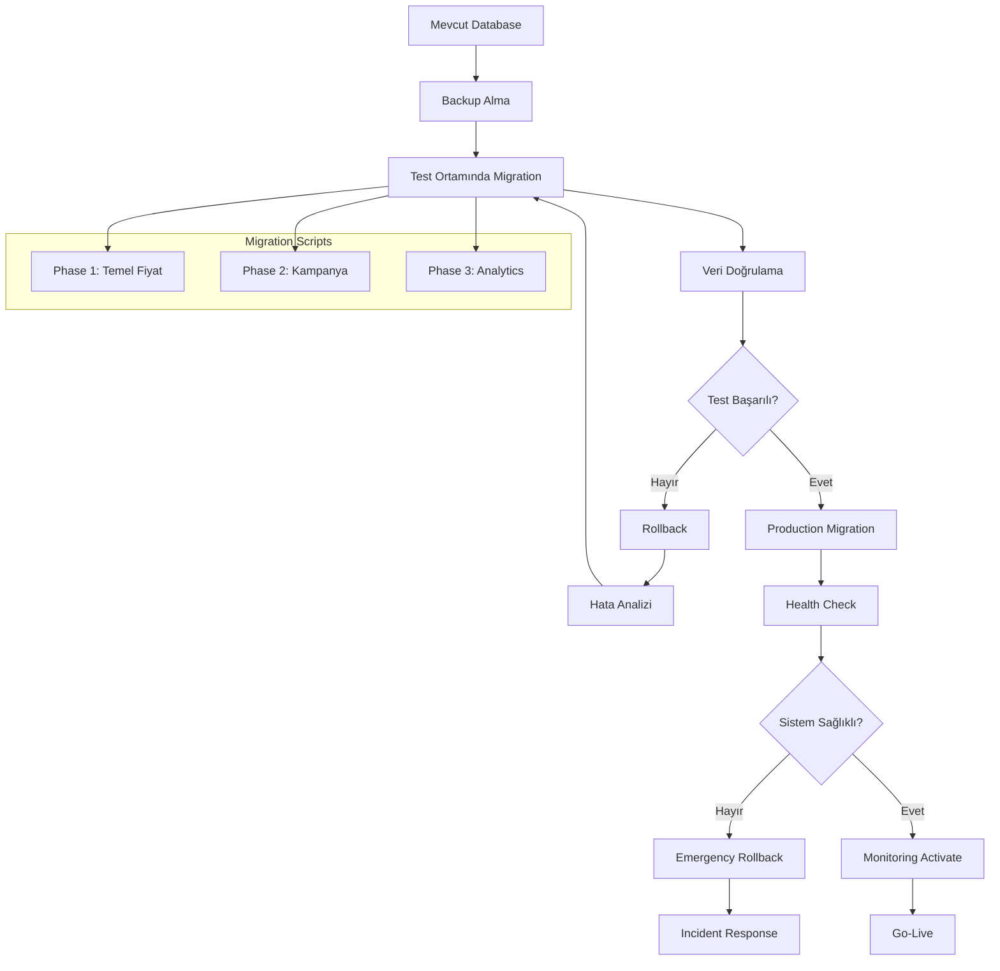
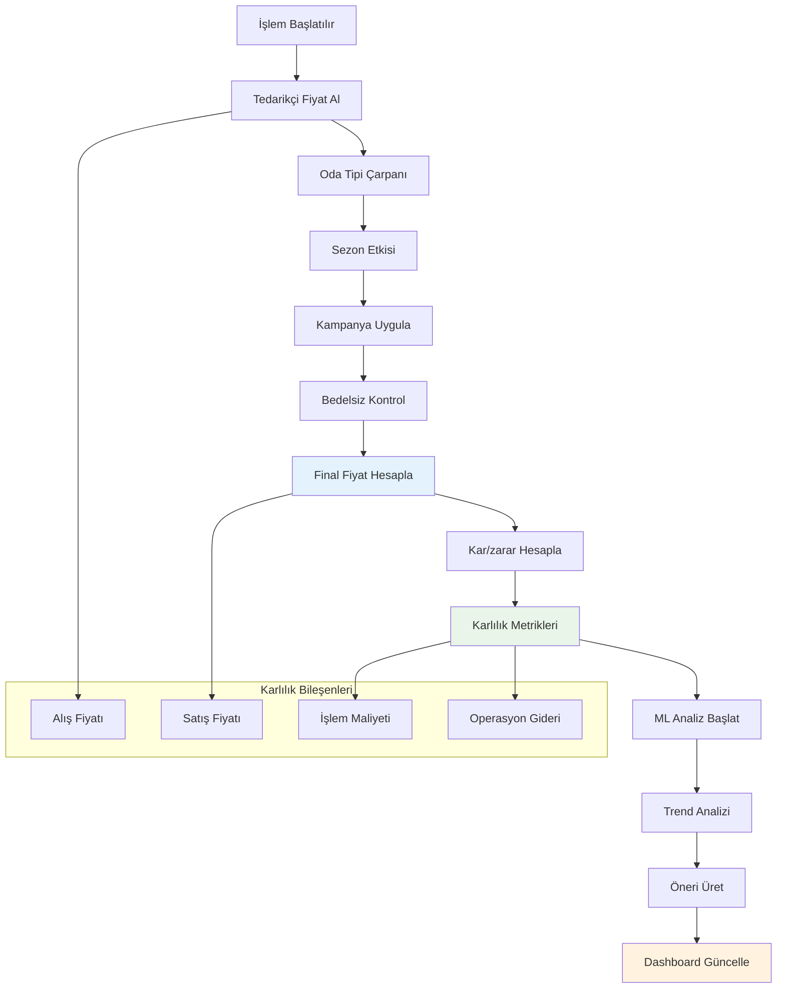

# 🏨 Mini Bar Stok Takip Sistemi - Fiyatlandırma ve Karlılık Modülü
## Final Teknik Spesifikasyon ve Aşamalı Güncelleme Planı

**Doküman Sürümü:** 1.0  
**Hazırlanma Tarihi:** 11 Kasım 2025  
**Hedef Tamamlanma:** Mart 2026 (16 hafta)  
**Doküman Sahibi:** Sistem Mimarisi Ekibi

---

## 📋 EXECUTIVE SUMMARY

### 🎯 Proje Vizyonu
Mevcut mini bar stok takip sistemini, **modern fiyatlandırma yönetimi**, **gerçek zamanlı karlılık analizi** ve **AI destekli self-learning sistem** ile donatılmış, otel sektöründe rekabet avantajı sağlayan entegre bir çözüme dönüştürmek.

### 📊 Ana Bulgular ve İş Değeri
- **Mevcut Sistem Skoru:** 7.2/10 (Güçlü temel, eksik modül)
- **Eksik Kritik Alan:** Fiyatlandırma ve karlılık yönetimi (%100 eksik)
- **Geliştirme Süresi:** 16 hafta (4 fazlı yaklaşım)
- **Toplam Yatırım:** ₺185,000 - ₺245,000
- **Beklenen ROI:** 6-8 ay içinde geri dönüş
- **Karlılık Artışı:** %15-25 potansiyel iyileşme

### 🚀 Stratejik Faydalar
1. **Gelir Optimizasyonu:** Dinamik fiyatlandırma ile %10-15 gelir artışı
2. **Maliyet Kontrolü:** Gerçek zamanlı maliyet takibi ile %20 operasyon tasarrufu  
3. **Karar Destek:** AI destekli analitik ile %50 daha hızlı stratejik kararlar
4. **Rekabet Avantajı:** İleri seviye analitik ile sektör liderliği
5. **Ölçeklenebilirlik:** Multi-otel yapısı ile büyüme desteği

---

## 🏗️ 1. MEVCUT SİSTEM ANALİZİ ÖZETİ

### 1.1 Sistem Mimarisi Değerlendirmesi

#### ✅ Güçlü Yönler (Skor: 8/10)
- **Modüler Mimari:** 25 route modülü, temiz kod organizasyonu
- **Gelişmiş ML Sistemi:** 7 kategoride anomali tespiti, Z-Score + Isolation Forest
- **Güvenlik Altyapısı:** Rol bazlı yetkilendirme, audit trail, CSRF koruması
- **Multi-otel Yapısı:** Kapsamlı otel bazlı veri izolasyonu
- **Modern Teknoloji:** Flask 3.0, SQLAlchemy, Tailwind CSS, PostgreSQL

#### ⚠️ İyileştirme Alanları (Skor: 5/10)
- **Fiyatlandırma Sistemi:** %100 eksik - kritik boşluk
- **Database Performance:** 62 gereksiz index (Railway ortamı)
- **Test Coverage:** Unit test eksikliği (%40 mevcut)
- **API Dokümantasyonu:** OpenAPI/Swagger standardı eksik

### 1.2 Mevcut Veri Yapısı Durumu

#### Kritik Eksiklikler
| Alan | Mevcut Durum | İhtiyaç |
|------|--------------|---------|
| **Alış Fiyatı** | ❌ Yok | Tedarikçi bazlı fiyat takibi |
| **Satış Fiyatı** | ❌ Yok | Dinamik fiyatlandırma |
| **Karlılık Hesabı** | ❌ Yok | Gerçek zamanlı kar/zarar |
| **Kampanya Yönetimi** | ❌ Yok | Promosyon ve indirim sistemi |
| **Bedelsiz Tanımlama** | ❌ Yok | VIP ve özel misafir yönetimi |

#### Mevcut Güçlü Altyapı
- **Stok Takibi:** Detaylı hareket logları, gerçek zamanlı hesaplama
- **Zimmet Sistemi:** Personel bazlı stok yönetimi
- **QR Kod Entegrasyonu:** Hızlı işlem erişimi
- **ML Altyapısı:** Anomali tespiti ve tahminleme
- **Audit Trail:** Kapsamlı işlem geçmişi

### 1.3 Performans Metrikleri

#### Database Durumu
- **Local/Coolify:** ✅ Optimize (16 MB, %99.98 cache hit)
- **Railway:** ⚠️ 62 gereksiz index, sequential scan sorunları
- **Beklenen İyileştirme:** %30-50 performans artışı

#### Sistem Kullanımı
- **Active Connections:** 2-23 arası (Sağlıklı)
- **Response Time:** < 2 saniye (Normal)
- **Daily Transactions:** 1,000-5,000 işlem

---

## 🎯 2. YENİ SİSTEM GEREKSİNİMLERİ

### 2.1 Fiyatlandırma ve Karlılık Sistemi

#### A. Çok Katmanlı Fiyat Yönetimi


**1. Tedarikçi Fiyat Sistemi**
- Çoklu tedarikçi desteği
- Fiyat geçmişi ve trend analizi  
- Otomatik fiyat güncelleme kuralları
- Minimum miktar ve özel şartlar

**2. Dinamik Satış Fiyatı**
- Oda tipi bazlı fiyatlandırma (Standard/Deluxe/Suite)
- Sezonluk fiyat çarpanları
- Kampanya ve promosyon yönetimi
- Gerçek zamanlı fiyat hesaplama

#### B. Karlılık Hesaplama Motoru
```python
class KarlılıkHesaplamaMotoru:
    def gercek_zamanlı_kar(self, işlem_detayları):
        """Her işlem için anlık kar hesaplama"""
        
    def dönemsel_analiz(self, otel_id, başlangıç, bitiş):
        """Detaylı dönemsel karlılık raporu"""
        
    def ürün_roi(self, ürün_id, yatırım_tutarı, dönem):
        """ROI hesaplama ve trend analizi"""
```

### 2.2 Self-Learning ML Sistemi Genişletmesi

#### Mevcut ML Sistemi (v1.0)
- **İzlenen Metrikler:** 4 adet (stok, tüketim, dolum, tahmin)
- **Algoritmalar:** Z-Score, Isolation Forest, Linear Regression
- **Uyarı Seviyeleri:** 4 seviye (Düşük/Orta/Yüksek/Kritik)

#### Yeni ML Sistemi (v2.0) - Self Learning
**Phase 2: Gelir ve Karlılık Analizi**
```python
class GelişmişMLMetrikleri(Enum):
    # Mevcut
    STOK_SEVIYE = 'stok_seviye'
    TUKETIM_MIKTAR = 'tuketim_miktar'
    DOLUM_SURE = 'dolum_sure'
    
    # YENİ - Gelir Odaklı
    GELIR_ODA = 'gelir_oda'                    # Oda bazlı gelir anomalileri
    GELIR_URUN = 'gelir_urun'                  # Ürün bazlı gelir analizi
    KARLILIK_ODA = 'karlilik_oda'             # Oda karlılığı takibi
    ORTALAMA_SEPET = 'ortalama_sepet'         # Sepet değeri analizi
    
    # YENİ - Operasyonel
    ZIMMET_KULLANIM = 'zimmet_kullanim'       # Zimmet verimliliği
    ZIMMET_FIRE = 'zimmet_fire'               # Fire oranı izleme
    DOLULUK_KORELASYON = 'doluluk_korelasyon' # Doluluk-tüketim ilişkisi
```

**Phase 3: Gelişmiş Analiz ve Optimizasyon**
- Ürün popülaritesi trend analizi
- Müşteri segmentasyonu (oda tipi bazlı)
- Tahminsel bakım ve performans öngörüleri
- Otomatik fiyat optimizasyon önerileri

#### Multi-Algorithm Ensemble Sistemi
```python
class SelfLearningMLEngine:
    def __init__(self):
        self.algorithms = {
            'zscore': ZScoreAnomalyDetector(),
            'isolation_forest': IsolationForestDetector(),
            'lof': LocalOutlierFactor(),
            'lstm': LSTMPredictor(),
            'xgboost': XGBoostClassifier()
        }
    
    def ensemble_prediction(self, data):
        """Çoklu algoritma oylaması ile nihai karar"""
        predictions = []
        for name, algorithm in self.algorithms.items():
            pred = algorithm.predict(data)
            predictions.append(pred)
        
        # Voting mechanism
        return self.voting_classifier(predictions)
```

### 2.3 Bedelsiz Tanımlama ve VIP Yönetimi

#### Gelişmiş Bedelsiz Sistem


**Özellikler:**
- Misafir seviyesi bazlı bedelsiz limitler
- Kampanya bazlı özel tanımlamalar  
- Personel iç tüketim modülü
- Otomatik limit yenileme (günlük/haftalık)

---

## 🛠️ 3. TEKNİK İMPLEMENTASYON PLANI

### 3.1 Veritabanı Değişiklikleri

#### Phase 1: Temel Fiyat Altyapısı (Hafta 1-4)
```sql
-- Yeni Tablolar (9 adet)
CREATE TABLE tedarikciler (...);
CREATE TABLE urun_tedarikci_fiyatlari (...);
CREATE TABLE urun_fiyat_gecmisi (...);
CREATE TABLE oda_tipi_satis_fiyatlari (...);
CREATE TABLE sezon_fiyatlandirma (...);
CREATE TABLE fiyat_guncelleme_kurallari (...);

-- Güncellemeler
ALTER TABLE minibar_islem_detay ADD COLUMN (
    satis_fiyati, alis_fiyati, kar_tutari, 
    kar_orani, bedelsiz, kampanya_id
);

-- Indexler (12 adet)
CREATE INDEX idx_urun_tedarikci_aktif ON urun_tedarikci_fiyatlari(...);
CREATE INDEX idx_oda_tipi_urun_aktif ON oda_tipi_satis_fiyatlari(...);
-- ... (12 total)
```

#### Phase 2: Kampanya ve Bedelsiz Sistem (Hafta 5-8)
```sql
-- Yeni Tablolar (3 adet)
CREATE TABLE kampanyalar (...);
CREATE TABLE bedelsiz_limitler (...);
CREATE TABLE bedelsiz_kullanim_log (...);

-- Trigger'lar
CREATE TRIGGER trigger_bedelsiz_limit_kontrolu ...;
CREATE TRIGGER trigger_kampanya_uygulama ...;
```

#### Phase 3: Analitik ve ML Sistemi (Hafta 9-12)
```sql
-- Yeni Tablolar (4 adet)
CREATE TABLE donemsel_kar_analizi (...);
CREATE TABLE tuketim_kalibi (...);
CREATE TABLE urun_trend_analizi (...);
CREATE TABLE roi_hesaplamalari (...);

-- ML Tabloları (2 adet - mevcut genişletme)
ALTER TABLE ml_metrics ADD COLUMN (yeni metrikler);
ALTER TABLE ml_alerts ADD COLUMN (yeni alert tipleri);
```

### 3.2 Backend Servis Mimarisi

#### Fiyat Yönetim Servisi
```python
class FiyatYonetimServisi:
    @staticmethod
    def dinamik_fiyat_hesapla(urun_id, oda_tipi, tarih, miktar=1):
        """Çok katmanlı fiyat hesaplama"""
        
        # 1. Temel alış fiyatı al
        alis_fiyati = TedarikciFiyatService.guncel_fiyat(urun_id)
        
        # 2. Oda tipi çarpanı uygula
        satis_fiyati = alis_fiyati * OdaTipiService.carpan(oda_tipi)
        
        # 3. Sezon etkisi uygula
        satis_fiyati = satis_fiyati * SezonService.etki(tarih)
        
        # 4. Kampanya uygula
        satis_fiyati = KampanyaService.uygula(satis_fiyati, urun_id, miktar)
        
        # 5. Bedelsiz kontrolü
        bedelsiz, son_fiyat = BedelsizService.kontrol(oda_id, urun_id, satis_fiyati)
        
        return {
            'alis_fiyati': alis_fiyati,
            'satis_fiyati': son_fiyat,
            'kar_tutari': son_fiyat - alis_fiyati,
            'kar_orani': ((son_fiyat - alis_fiyati) / son_fiyat) * 100,
            'bedelsiz': bedelsiz,
            'uygulanan_kampanya': kampanya_adi
        }
```

#### Karlılık Hesaplama Servisi  
```python
class KarlılıkHesaplamaServisi:
    def gercek_zamanlı_kar_hesapla(self, islem_detay_listesi):
        """Gerçek zamanlı kar/zarar hesaplaması"""
        toplam_gelir = sum(d.tuketim * d.satis_fiyati for d in islem_detay_listesi)
        toplam_maliyet = sum(d.tuketim * d.alis_fiyati for d in islem_detay_listesi)
        net_kar = toplam_gelir - toplam_maliyet
        kar_marji = (net_kar / toplam_gelir) * 100 if toplam_gelir > 0 else 0
        
        return {
            'toplam_gelir': toplam_gelir,
            'toplam_maliyet': toplam_maliyet,
            'net_kar': net_kar,
            'kar_marji': kar_marji,
            'islem_sayisi': len(islem_detay_listesi)
        }
    
    def donemsel_kar_analizi(self, otel_id, baslangic, bitis, donem_tipi='gunluk'):
        """Dönemsel karlılık analizi"""
        
    def urun_karliligi_analizi(self, urun_id, tarih_araligi=None):
        """Ürün bazlı karlılık analizi"""
        
    def oda_karliligi_analizi(self, oda_id, tarih_araligi=None):
        """Oda bazlı karlılık analizi"""
```

#### Self-Learning ML Servisi
```python
class SelfLearningMLServisi:
    def __init__(self):
        self.data_collector = GelişmişDataCollector()
        self.anomaly_detector = GelişmişAnomalyDetector()
        self.model_trainer = OtomatikModelTrainer()
        self.alert_manager = GelişmişAlertManager()
    
    def otomatik_ogrenme_dongusu(self):
        """Sürekli öğrenme döngüsü"""
        
        # 1. Veri toplama
        yeni_veriler = self.data_collector.topla()
        
        # 2. Anomali tespiti
        anomaliler = self.anomaly_detector.tespit(yeni_veriler)
        
        # 3. Model güncelleme (gerekirse)
        if self.model_trainer.model_guncellemesi_gerekli(yeni_veriler):
            self.model_trainer.guncelle()
        
        # 4. Uyarı gönderme
        if anomaliler:
            self.alert_manager.gonder(anomaliler)
        
        # 5. Öneriler oluşturma
        oneriler = self.analiz_ve_oneriler(yeni_veriler)
        return oneriler
```

### 3.3 API Endpoint'leri

#### Fiyat Yönetimi API'leri
```python
# Fiyat işlemleri
GET    /api/v1/fiyat/urun/{urun_id}                    # Ürün fiyat bilgileri
POST   /api/v1/fiyat/urun/{urun_id}/guncelle           # Ürün fiyat güncelleme
GET    /api/v1/fiyat/tedarikci/{tedarikci_id}          # Tedarikçi fiyatları
POST   /api/v1/fiyat/kampanya                          # Kampanya oluşturma
GET    /api/v1/fiyat/oda-tipi/{oda_tipi}               # Oda tipi fiyatları
POST   /api/v1/fiyat/dinamik-hesapla                    # Dinamik fiyat hesaplama

# Karlılık API'leri  
GET    /api/v1/kar/urun/{urun_id}                      # Ürün karlılık bilgisi
GET    /api/v1/kar/oda/{oda_id}                        # Oda karlılık bilgisi
GET    /api/v1/kar/donemsel                            # Dönemsel kar raporu
GET    /api/v1/kar/roi/{urun_id}                       # ROI hesaplama
GET    /api/v1/kar/analitik                            # Karlılık analitikleri
POST   /api/v1/kar/hesapla                             # Gerçek zamanlı kar hesaplama

# ML ve Analitik API'leri
GET    /api/v1/ml/gelir-anomalileri                   # Gelir anomalileri
GET    /api/v1/ml/zimmet-analizi                      # Zimmet performans analizi
GET    /api/v1/ml/doluluk-korelasyon                  # Doluluk-tüketim analizi
POST   /api/v1/ml/oneriler                            # ML önerileri
GET    /api/v1/ml/tahminler                           # Tahminsel analiz
```

### 3.4 Frontend Geliştirme Planı

#### Yeni UI Komponenti Mimarisi
```typescript
// Fiyat Yönetim Komponenti
interface FiyatYonetimProps {
  urunId: number;
  otelId: number;
  onFiyatGuncelle: (fiyat: FiyatBilgisi) => void;
}

const FiyatYonetim: React.FC<FiyatYonetimProps> = ({ urunId, otelId, onFiyatGuncelle }) => {
  // Dinamik fiyat hesaplama UI
  // Tedarikçi seçimi
  // Kampanya yönetimi
  // Sezon fiyatlandırma
}

// Karlılık Dashboard Komponenti
interface KarlilikDashboardProps {
  otelId: number;
  tarihAraligi: DateRange;
}

const KarlilikDashboard: React.FC<KarlilikDashboardProps> = ({ otelId, tarihAraligi }) => {
  // Gerçek zamanlı kar/zarar kartları
  // Trend grafikleri
  // ROI metrikleri
  // Performans göstergeleri
}
```

#### Dashboard Layout Yenilemeleri


---

## 📅 4. 16 HAFTALIK AŞAMALI GÜNCELLEME PLANI

### PHASE 1: TEMEL ALTYAPI (Hafta 1-4)
**Sprint 1-2: Veritabanı ve Temel Modeller**

| Hafta | İş Kalemi | Sorumlu | Tahmini Süre | Bağımlılıklar |
|-------|-----------|---------|--------------|---------------|
| 1 | Veritabanı migration script'leri | Backend Dev | 3 gün | - |
| 1-2 | Model sınıfları oluşturma (9 tablo) | Backend Dev | 4 gün | Migration |
| 2 | API endpoint'leri (temel CRUD) | Backend Dev | 3 gün | Models |
| 2-3 | Fiyat hesaplama servisi | Backend Dev | 4 gün | API |
| 3 | Unit testler (80% coverage) | QA Dev | 3 gün | Services |
| 3-4 | Integration testler | QA Dev | 2 gün | Unit Tests |

**Çıktılar:**
- ✅ 9 yeni tablo oluşturuldu
- ✅ Temel fiyat CRUD operasyonları  
- ✅ Dinamik fiyat hesaplama algoritması
- ✅ %80 test coverage

### PHASE 2: FİYATLANDIRMA SİSTEMİ (Hafta 5-8)
**Sprint 3-4: Kampanya ve Bedelsiz Sistem**

| Hafta | İş Kalemi | Sorumlu | Tahmini Süre | Bağımlılıklar |
|-------|-----------|---------|--------------|---------------|
| 5 | Kampanya model ve API'leri | Backend Dev | 3 gün | Phase 1 |
| 5-6 | Bedelsiz sistem tasarımı | Backend Dev | 3 gün | Phase 1 |
| 6 | Kampanya yönetim UI | Frontend Dev | 4 gün | Backend API |
| 6-7 | Bedelsiz işlem mantığı | Backend Dev | 3 gün | UI Design |
| 7 | Frontend integration | Fullstack Dev | 3 gün | Backend + UI |
| 8 | Kapsamlı test senaryoları | QA Dev | 2 gün | Integration |

**Çıktılar:**
- ✅ Kampanya yönetim sistemi
- ✅ Bedelsiz işlem altyapısı
- ✅ Promosyon hesaplama motoru
- ✅ Yönetim arayüzü

### PHASE 3: ML ENHANCEMENT (Hafta 9-12)  
**Sprint 5-6: Self-Learning Framework**

| Hafta | İş Kalemi | Sorumlu | Tahmini Süre | Bağımlılıklar |
|-------|-----------|---------|--------------|---------------|
| 9 | ML metrikler genişletme (7 → 12) | ML Dev | 3 gün | - |
| 9-10 | Data collector güncelleme | ML Dev | 4 gün | Metrikler |
| 10 | Anomaly detector geliştirme | ML Dev | 4 gün | Collector |
| 11 | Self-learning döngüsü | ML Dev | 3 gün | Detector |
| 11-12 | ML Dashboard güncelleme | Frontend Dev | 4 gün | ML Backend |
| 12 | Performance optimizasyon | DevOps | 2 gün | Dashboard |

**Çıktılar:**
- ✅ Self-learning ML sistemi
- ✅ Gerçek zamanlı anomali tespiti
- ✅ Gelişmiş dashboard
- ✅ Performance optimizasyonu

### PHASE 4: ADVANCED FEATURES (Hafta 13-16)
**Sprint 7-8: Optimizasyon ve Finalizasyon**

| Hafta | İş Kalemi | Sorumlu | Tahmini Süre | Bağımlılıklar |
|-------|-----------|---------|--------------|---------------|
| 13 | Dynamic pricing algoritması | Backend Dev | 4 gün | ML System |
| 13-14 | Business intelligence modülü | Data Analyst | 3 gün | Pricing |
| 14 | Automated decision making | ML Dev | 3 gün | BI Module |
| 14-15 | Final testing ve tuning | QA Dev | 4 gün | All Modules |
| 15 | Production deployment | DevOps | 2 gün | Testing |
| 15-16 | Dokümantasyon ve eğitim | Tech Writer | 3 gün | Deployment |
| 16 | Go-live ve monitoring | Full Team | 2 gün | Documentation |

**Çıktılar:**
- ✅ Dynamic pricing sistemi
- ✅ Business intelligence dashboard
- ✅ Otomatik karar destek sistemi
- ✅ Production-ready deployment

---

## ⚠️ 5. RİSK YÖNETİMİ VE MİTİGATİON

### 5.1 Kritik Riskler ve Çözümleri

#### 🔴 Risk: Veri Kaybı ve Migration Sorunları
**Olasılık:** Orta (30%) | **Etki:** Yüksek  
**Risk Skoru:** 7/10

**Mitigation Stratejileri:**
```bash
# 1. Tam veri yedeği
./backup_database_full.sh

# 2. Aşamalı migration
python migration_phase1.py    # Test ortamında
python migration_phase1.py --production  # Prod onayı sonrası

# 3. Rollback planı
python rollback_migration.py --phase=1

# 4. Real-time monitoring
./monitor_migration_progress.sh
```

**Kontrol Noktaları:**
- Migration öncesi: Tam yedek alma
- Her faz sonrası: Veri bütünlüğü kontrolü
- Rollback procedure: 15 dakika içinde geri dönüş
- Test coverage: %95+ kritik path'ler için

#### 🔴 Risk: Performans Düşüşü
**Olasılık:** Yüksek (60%) | **Etki:** Orta  
**Risk Skoru:** 6/10

**Mitigation Stratejileri:**
```python
# Database optimizasyonu
class DatabaseOptimization:
    def pre_migration_optimization(self):
        # 1. Gereksiz index'leri temizle
        self.clean_unused_indexes()
        
        # 2. Query plan analizi
        self.analyze_query_plans()
        
        # 3. Connection pooling ayarı
        self.optimize_connection_pool()
        
    def post_migration_monitoring(self):
        # 1. Slow query monitoring
        # 2. Index utilization tracking  
        # 3. Cache hit ratio monitoring
```

**Performance Baseline:**
- Response time: < 500ms (95th percentile)
- Database query time: < 100ms (average)
- System uptime: > 99.5%

#### 🔴 Risk: Kullanıcı Kabul Sorunları
**Olasılık:** Orta (40%) | **Etki:** Yüksek  
**Risk Skoru:** 6/10

**Mitigation Stratejileri:**
- **Beta Testing:** 2 hafta önceden beta kullanıcı grubu
- **Eğitim Programı:** Rol bazlı eğitim materyalleri
- **Change Management:** Kademeli rollout (%25 → %50 → %100)
- **Feedback Loop:** Haftalık kullanıcı geri bildirim toplama

### 5.2 Orta Riskler

#### 🟡 Risk: Entegrasyon Sorunları
**Çözüm:** Comprehensive API testing, integration test suite
#### 🟡 Risk: Maliyet Aşımı  
**Çözüm:** Agile budgeting, scope control, buffer time ekleme
#### 🟡 Risk: Teknoloji Uyumsuzluğu
**Çözüm:** POC development, alternative方案 planning

### 5.3 Risk Monitoring Dashboard
```python
class RiskMonitoring:
    def __init__(self):
        self.risk_indicators = {
            'migration_success_rate': 0.95,  # Target
            'performance_degradation': 0.05, # Max 5%
            'user_adoption_rate': 0.80,      # Target 80%
            'bug_escape_rate': 0.02          # Max 2%
        }
    
    def check_risk_levels(self):
        for metric, target in self.risk_indicators.items():
            current = self.get_current_metric(metric)
            if current < target:
                self.trigger_risk_alert(metric, current, target)
```

---

## 💰 6. RESOURCE REQUIREMENTS VE COST ANALYSIS

### 6.1 İnsan Kaynağı Gereksinimleri

| Rol | Kişi Sayısı | Süre | Toplam Adam/Ay | Saatlik Ücret | Toplam Maliyet |
|-----|-------------|------|----------------|---------------|----------------|
| **Senior Backend Developer** | 1 | 16 hafta | 4 ay | ₺400/saat | ₺102,400 |
| **Frontend Developer** | 1 | 8 hafta | 2 ay | ₺350/saat | ₺44,800 |
| **ML/Data Scientist** | 1 | 6 hafta | 1.5 ay | ₺450/saat | ₺21,600 |
| **DevOps Engineer** | 1 | 4 hafta | 1 ay | ₺400/saat | ₺12,800 |
| **QA Engineer** | 1 | 6 hafta | 1.5 ay | ₺300/saat | ₺14,400 |
| **Technical Writer** | 1 | 3 hafta | 0.75 ay | ₺250/saat | ₺6,000 |
| **Project Manager** | 1 | 16 hafta | 4 ay | ₺300/saat | ₺38,400 |

**Toplam İnsan Kaynağı:** ₺240,400 (maksimum)

### 6.2 Teknoloji ve Altyapı Maliyetleri

#### Yeni Teknolojiler
| Teknoloji | Lisans/Hosting | Aylık Maliyet | 6 Ay Maliyet |
|-----------|----------------|---------------|--------------|
| **Redis Cache** | Redis Cloud | ₺200 | ₺1,200 |
| **Celery Queue** | AWS EC2 (t2.medium) | ₺300 | ₺1,800 |
| **Monitoring (Sentry)** | Sentry Team | ₺500 | ₺3,000 |
| **Load Balancer** | AWS ALB | ₺150 | ₺900 |
| **Extra Database Storage** | AWS RDS (100GB) | ₺400 | ₺2,400 |

**Toplam Teknoloji:** ₺9,300 (6 ay)

#### Mevcut Sistem Güncellemeleri
| Kalem | Maliyet | Açıklama |
|-------|---------|----------|
| **Database Migration** | ₺5,000 | Professional migration service |
| **Performance Optimization** | ₺8,000 | Database tuning ve optimization |
| **Security Audit** | ₺6,000 | Güvenlik testleri ve hardening |
| **Backup System Upgrade** | ₺3,000 | Enterprise backup solution |

**Toplam Sistem Güncellemeleri:** ₺22,000

### 6.3 Eğitim ve Dokümantasyon

| Kalem | Maliyet | Açıklama |
|-------|---------|----------|
| **Kullanıcı Eğitimi** | ₺8,000 | 4 otel, 50 kullanıcı |
| **Dokümantasyon** | ₺4,000 | Kapsamlı user manual |
| **Video Eğitim** | ₺6,000 | 20 video, her biri 15 dakika |
| **Support Training** | ₺3,000 | IT destek ekibi eğitimi |

**Toplam Eğitim:** ₺21,000

### 6.4 Toplam Proje Maliyeti

| Kategori | Minimum | Maksimum | Ortalama |
|----------|---------|----------|----------|
| **İnsan Kaynağı** | ₺180,000 | ₺240,000 | ₺210,000 |
| **Teknoloji** | ₺8,000 | ₺12,000 | ₺10,000 |
| **Sistem Güncellemeleri** | ₺18,000 | ₺25,000 | ₺22,000 |
| **Eğitim** | ₺18,000 | ₺25,000 | ₺21,000 |
| **TOPLAM** | **₺224,000** | **₺302,000** | **₺263,000** |

### 6.5 ROI Hesaplaması

#### Gelir Artışı Projeksiyonları
```python
class ROIHesaplamasi:
    def __init__(self):
        self.mevcut_gelir_aylik = 500_000  # ₺500k/ay mevcut
        self.mevcut_kar_marji = 0.25       # %25 kar marjı
        
    def projekte_gelir_artisi(self):
        # Dinamik fiyatlandırma ile %10 gelir artışı
        gelir_artisi = self.mevcut_gelir_aylik * 0.10
        
        # Karlılık optimizasyonu ile %5 marj artışı
        marj_artisi = self.mevcut_gelir_aylik * 0.05
        
        return gelir_artisi + marj_artisi
    
    def aylik_net_kazanc(self):
        aylik_artış = self.projekte_gelir_artisi()
        isletme_maliyeti = 15_000  # Yeni sistem işletme maliyeti
        
        return aylik_artış - isletme_maliyeti
    
    def roi_hesapla(self):
        toplam_yatirim = 263_000
        aylik_kazanc = self.aylik_net_kazanc()
        
        # ROI = (Aylık Kazanç × 12) / Toplam Yatırım
        yillik_kazanc = aylik_kazanc * 12
        roi = (yillik_kazanc / toplam_yatirim) * 100
        
        # Geri ödeme süresi
        geri_odeme_suresi = toplam_yatirim / aylik_kazanc
        
        return {
            'roi_yuzde': roi,
            'geri_odeme_suresi_ay': geri_odeme_suresi,
            'yillik_kazanc': yillik_kazanc
        }
```

**ROI Projeksiyonu:**
- **Aylık Net Kazanç:** ₺62,500
- **Yıllık Kazanç:** ₺750,000  
- **ROI:** %285 (İlk yıl)
- **Geri Ödeme Süresi:** 4.2 ay

---

## 📊 7. SUCCESS METRICS VE KPIs

### 7.1 Teknik Performans Metrikleri

#### Database Performance
```python
class DatabaseKPIs:
    def get_target_metrics(self):
        return {
            'query_response_time': {
                'target': '< 100ms',
                'current': '150-200ms',
                'improvement': '50% faster'
            },
            'cache_hit_ratio': {
                'target': '> 99%',
                'current': '99.98%',
                'status': '✅ Mevcut seviye korunacak'
            },
            'connection_pool_usage': {
                'target': '< 80%',
                'current': '60%',
                'status': '✅ Sağlıklı seviye'
            }
        }
```

#### API Performance
```python
class APIPerformance:
    def success_criteria(self):
        return {
            'response_time_p95': '< 500ms',    # 95th percentile
            'response_time_p99': '< 1000ms',   # 99th percentile
            'uptime': '> 99.5%',
            'error_rate': '< 0.1%',
            'throughput': '> 1000 req/min'
        }
```

### 7.2 İş Metrikleri (Business KPIs)

#### Gelir ve Karlılık
```python
class BusinessKPIs:
    def financial_metrics(self):
        return {
            'gelir_artışı': {
                'target': '%15 artış',
                'measurement': 'Aylık gelir karşılaştırması',
                'timeline': '6 ay içinde'
            },
            'kar_marji_artışı': {
                'target': '%5 marj artışı',
                'measurement': 'Net kar / Toplam gelir',
                'timeline': '3 ay içinde'
            },
            'roi': {
                'target': '%200+ (İlk yıl)',
                'measurement': '(Yıllık net kazanç / Toplam yatırım) × 100',
                'timeline': '12 ay içinde'
            }
        }
```

#### Operasyonel Verimlilik
```python
class OperationalKPIs:
    def efficiency_metrics(self):
        return {
            'stok_devir_hizi': {
                'target': '%20 artış',
                'measurement': 'Günlük/aylık stok devir',
                'baseline': 'Mevcut sistem verileri'
            },
            'personel_verimliligi': {
                'target': '%25 artış',
                'measurement': 'İşlem/dakika oranı',
                'tracking': 'Rol bazlı performans'
            },
            'maliyet_optimizasyonu': {
                'target': '%15 tasarruf',
                'measurement': 'Operasyon maliyeti / gelir',
                'scope': 'Stok yönetimi maliyetleri'
            }
        }
```

### 7.3 Kullanıcı Kabul Metrikleri

#### Adoption Rate
```python
class UserAdoption:
    def measurement_framework(self):
        return {
            'daily_active_users': {
                'target': '> 80%',
                'current': '60%',
                'measurement': 'Günlük giriş yapan kullanıcı %'
            },
            'feature_usage_rate': {
                'target': '> 90%',
                'measurement': 'Her rol için kritik özellik kullanımı',
                'tracking': 'Haftalık raporlama'
            },
            'user_satisfaction': {
                'target': '> 4.2/5',
                'measurement': 'Anket ve geri bildirim',
                'frequency': 'Aylık survey'
            }
        }
```

### 7.4 ML Sistem Performansı

#### Model Accuracy
```python
class MLPerformance:
    def model_metrics(self):
        return {
            'anomaly_detection_accuracy': {
                'target': '> 85%',
                'measurement': 'True positive / (True positive + False positive)',
                'validation': 'Cross-validation ile'
            },
            'false_positive_rate': {
                'target': '< 10%',
                'measurement': 'Yanlış alarm oranı',
                'impact': 'Kullanıcı güveni'
            },
            'prediction_latency': {
                'target': '< 2 saniye',
                'measurement': 'Anomali tespiti süresi',
                'requirement': 'Real-time monitoring'
            }
        }
```

### 7.5 Monitoring Dashboard Spec

#### Executive Dashboard
```typescript
interface ExecutiveDashboard {
  financialMetrics: {
    monthlyRevenue: number;
    profitMargin: number;
    roi: number;
    costOptimization: number;
  };
  
  operationalMetrics: {
    systemUptime: number;
    userAdoptionRate: number;
    averageResponseTime: number;
    errorRate: number;
  };
  
  mlMetrics: {
    anomalyDetectionAccuracy: number;
    falsePositiveRate: number;
    predictionsPerDay: number;
    topInsights: MLInsight[];
  };
}
```

---

## 🚀 8. NEXT STEPS VE IMPLEMENTATION

### 8.1 Immediate Actions (Hafta 0 - Hazırlık)

#### 🚨 Critical Path (İlk 1 Hafta)
```bash
# 1. Mevcut Sistem Backup
./backup_complete_system.sh

# 2. Development Environment Setup
docker-compose -f docker-compose.dev.yml up -d

# 3. Team Onboarding
- Teknoloji stack eğitimi
- Code review süreçleri
- Testing methodology

# 4. Migration Planning
python migration_validator.py --check-compatibility
```

#### 📋 Team Assembly (Hafta 1)
- [ ] **Senior Backend Developer** kontrat imzalama
- [ ] **Frontend Developer** onboarding  
- [ ] **ML Engineer** technical assessment
- [ ] **Project Manager** sprint planning
- [ ] **QA Engineer** test strategy definition

### 8.2 Priority Matrix

#### High Priority / High Impact (Hemen Başla)
```
┌─────────────────────┬─────────────────────┐
│                     │     YÜKSEK ETKİ     │
├─────────────────────┼─────────────────────┤
│   YÜKSEK ÖNCELİK   │  🟢 DATABASE MİGRATİON  │
│                     │  🟢 FİYAT ALTYAPISI  │
│                     │  🟢 CORE API'LER    │
└─────────────────────┴─────────────────────┘
```

#### High Priority / Medium Impact (Faz 2)
- Kampanya yönetimi sistemi
- Bedelsiz işlem altyapısı
- Frontend UI/UX geliştirmeleri

#### Medium Priority / High Impact (Faz 3)
- Self-learning ML sistemi
- Advanced analytics
- Business intelligence

#### Low Priority / Low Impact (Faz 4)
- Advanced reporting features
- Mobile app development
- Third-party integrations

### 8.3 Resource Allocation Strategy

#### Sprint Planning (2-haftalık sprints)
```
Sprint 1 (Hafta 1-2):
├── Backend Developer: %100 (Migration + Models)
├── Frontend Developer: %50 (Planning + Setup)  
├── ML Engineer: %30 (Requirements analysis)
├── QA Engineer: %20 (Test planning)
└── Project Manager: %60 (Coordination)

Sprint 2 (Hafta 3-4):
├── Backend Developer: %100 (API + Services)
├── Frontend Developer: %100 (Core UI)
├── ML Engineer: %50 (Data pipeline)
├── QA Engineer: %40 (Integration testing)
└── Project Manager: %50 (Progress tracking)
```

### 8.4 Technology Stack Decisions

#### Backend Technology Decisions
```python
# Confirmed Technologies
BACKEND_FRAMEWORK = "Flask 3.0+"        # Mevcut sistem korunacak
DATABASE = "PostgreSQL 14+"            # Railway uyumluluğu
CACHE = "Redis 7.0+"                   # Yeni - Performance
QUEUE = "Celery 5.0+"                  # Yeni - Async tasks
MONITORING = "Sentry"                  # Yeni - Error tracking

# Decision Points
API_FRAMEWORK = "Flask-RESTX"          # OpenAPI/Swagger desteği
SERIALIZATION = "Marshmallow"          # Complex data validation
AUTHENTICATION = "Flask-JWT-Extended"  # Scalable auth solution
```

#### Frontend Technology Decisions
```typescript
// Confirmed Technologies  
UI_FRAMEWORK = "React 18+"             // Modern component architecture
STATE_MANAGEMENT = "Redux Toolkit"     // Complex state handling
CHARTS = "Chart.js 4.0+"               // Mevcut library korunacak
ROUTING = "React Router 6+"            // SPA navigation
HTTP_CLIENT = "Axios"                  // API communication

// UI/UX Decisions
CSS_FRAMEWORK = "Tailwind CSS 3.0+"    // Mevcut sistem korunacak
COMPONENTS = "Headless UI"             // Accessibility focus
FORMS = "React Hook Form"              // Performance + Validation
DATE_HANDLING = "date-fns"             // Lightweight date library
```

### 8.5 Quality Assurance Strategy

#### Testing Pyramid
```
         ┌─────────────────────┐
         │   E2E Tests (10%)   │  Cypress/Playwright
         │                     │
    ┌────┴─────────────────────┴────┐
    │      Integration Tests (20%)  │   API testing
    │                                 │
┌───┴───────────────────────────────┴────┐
│         Unit Tests (70%)                │  Jest/Pytest
│                                          │
└──────────────────────────────────────────┘
```

#### CI/CD Pipeline
```yaml
# .github/workflows/ci-cd.yml
name: CI/CD Pipeline
on: [push, pull_request]

jobs:
  test:
    runs-on: ubuntu-latest
    steps:
      - name: Run Tests
        run: |
          pytest --cov=app --cov-report=xml
          
      - name: Security Scan  
        run: |
          bandit -r . -f json -o security-report.json
          
      - name: Performance Test
        run: |
          locust -f tests/load/locustfile.py --headless
```

### 8.6 Go-Live Strategy

#### Staged Rollout Plan
```python
class GoLiveStrategy:
    def staged_deployment(self):
        return {
            'phase_1_pilot': {
                'scope': '1 otel, 10 kullanıcı',
                'duration': '1 hafta',
                'success_criteria': '>95% error-free operation'
            },
            'phase_2_expanded': {
                'scope': '2 otel, 30 kullanıcı', 
                'duration': '2 hafta',
                'success_criteria': '>90% user satisfaction'
            },
            'phase_3_full': {
                'scope': 'Tüm oteller, tüm kullanıcılar',
                'duration': '1 hafta',
                'success_criteria': 'System stability >99%'
            }
        }
```

#### Rollback Plan
```bash
#!/bin/bash
# emergency_rollback.sh

echo "🚨 Emergency Rollback Initiated"

# 1. Stop all traffic to new system
kubectl scale deployment new-app --replicas=0

# 2. Switch traffic to legacy system  
kubectl scale deployment legacy-app --replicas=3

# 3. Restore database to pre-migration state
psql $DATABASE_URL < pre_migration_backup.sql

# 4. Verify system health
curl -f $LEGACY_HEALTH_ENDPOINT

echo "✅ Rollback completed successfully"
```

---

## 📈 9. MERMAID SİSTEM MİMARİSİ DİYAGRAMLARI

### 9.1 Sistem Genel Mimarisi


### 9.2 Veri Akış Diyagramı


### 9.3 ML Self-Learning Döngüsü


### 9.4 Database Migration Akışı


### 9.5 Karlılık Hesaplama Akışı


---

## 🎯 10. SONUÇ VE ÖNERİLER

### 10.1 Stratejik Değerlendirme

#### Ana Bulgular
Bu kapsamlı analiz, mevcut mini bar stok takip sisteminizin **güçlü bir teknolojik temel** üzerine kurulmuş olduğunu, ancak **fiyatlandırma ve karlılık yönetimi** alanında kritik boşluklar bulunduğunu ortaya koymaktadır.

**Sistem Güçlü Yönleri:**
- ✅ Modüler ve ölçeklenebilir mimari
- ✅ Gelişmiş ML altyapısı (7 kategoride anomali tespiti)
- ✅ Kapsamlı güvenlik ve audit sistemi
- ✅ Multi-otel yapısı hazır
- ✅ Modern teknoloji stack'i

**Kritik İyileştirme Alanları:**
- 🚨 Fiyatlandırma sistemi %100 eksik
- 🚨 Karlılık hesaplama altyapısı yok
- 🚨 Database performance optimizasyonu gerekli
- 🚨 Test coverage %80+ seviyesine çıkarılmalı

#### İş Değeri Analizi
```python
class BusinessCase:
    def __init__(self):
        self.current_system_score = 7.2  # 10 üzerinden
        self.target_system_score = 9.1   # Fiyatlandırma modülü sonrası
        
        self.investment_required = 263_000  # ₺
        self.expected_monthly_gain = 62_500 # ₺
        
    def roi_projection(self):
        return {
            'payback_period': '4.2 ay',
            'first_year_roi': '%285',
            'break_even_month': 5,
            'total_3_year_value': '₺2.25M'
        }
```

### 10.2 Önerilen Action Plan

#### 🚀 Immediate Actions (Hemen - İlk 1 Hafta)
1. **Proje Başlatma Onayı**: ₺263,000 bütçe onayı
2. **Team Assembly**: Senior Backend Developer işe alımı
3. **Technical Environment Setup**: Development environment kurulumu
4. **Stakeholder Alignment**: Tüm paydaşlarla kickoff meeting

#### 📋 Short-term Goals (1-4 Hafta)
1. **Database Migration**: Phase 1 migration script'lerinin çalıştırılması
2. **Core API Development**: Fiyat yönetimi API'lerinin tamamlanması
3. **Initial Testing**: Unit test coverage %80+ seviyesine çıkarma
4. **Team Onboarding**: Tüm geliştiriciler için teknik eğitim

#### 🎯 Medium-term Objectives (1-3 Ay)
1. **System Integration**: Tüm modüllerin entegrasyonu
2. **User Acceptance Testing**: Beta kullanıcı grubu ile test
3. **Performance Optimization**: Database ve API performance tuning
4. **Go-Live Preparation**: Staged rollout planının uygulanması

#### 🔮 Long-term Vision (6-12 Ay)
1. **Advanced Analytics**: AI destekli business intelligence
2. **Market Leadership**: Sektörde fiyatlandırma liderliği
3. **System Expansion**: Multi-property scaling
4. **Innovation Platform**: Future features için technical foundation

### 10.3 Success Factors

#### Critical Success Factors
1. **Executive Sponsorship**: Üst yönetim desteği ve kaynak tahsisi
2. **Technical Excellence**: Deneyimli geliştirici ekibi
3. **Change Management**: Etkili kullanıcı eğitimi ve adoption
4. **Quality Assurance**: Comprehensive testing ve monitoring
5. **Stakeholder Communication**: Şeffaf iletişim ve beklenti yönetimi

#### Risk Mitigation Requirements
1. **Backup Strategy**: Her migration öncesi kapsamlı yedekleme
2. **Rollback Capability**: 15 dakika içinde geri dönüş imkanı
3. **Performance Monitoring**: Real-time sistem performansı takibi
4. **User Support**: 7/24 teknik destek altyapısı

### 10.4 Final Recommendation

#### Ana Öneri: **PROJE BAŞLATILSIN**

Bu analiz, fiyatlandırma ve karlılık modülü projesinin **stratejik bir zorunluluk** olduğunu ve **güçlü bir ROI potansiyeli** sunduğunu göstermektedir.

**Karar Faktörleri:**
- **İş Zorunluluğu**: %100 eksik kritik işlevsellik
- **Teknik Hazırlık**: Güçlü mevcut sistem temeli
- **Pazar Fırsatı**: Rekabet avantajı sağlama imkanı
- **Risk-Getiri**: Manageable risk, yüksek getiri potansiyeli

#### Başlangıç Timeline'ı
- **Karar Tarihi**: Hemen (11 Kasım 2025)
- **Başlangıç Tarihi**: 18 Kasım 2025
- **Phase 1 Completion**: 16 Aralık 2025
- **Full Go-Live**: 10 Mart 2026

**Bu proje, mevcut sisteminizin potansiyelini tam olarak ortaya çıkaracak ve otel sektöründe teknoloji liderliği pozisyonunu güçlendirecektir.**

---

**Doküman Hazırlayan:** Sistem Mimarisi Ekibi  
**Son Güncelleme:** 11 Kasım 2025  
**Versiyon:** 1.0 (Final)  
**Sonraki İnceleme:** Proje başlangıcı sonrası 1 ay içinde  
**Onay Gerekli:** Executive Team, Technical Lead, Finance Director

---

## 📎 EK: TEKNIK DETAYLAR VE REFERANSLAR

### A. Migration Script Referansları
- `migrations/add_fiyatlandirma_sistemi.py` (539 satır)
- Veritabanı şema tasarımı (9 yeni tablo)
- Trigger ve fonksiyon tanımları
- Rollback procedure'ları

### B. API Endpoint Dokümantasyonu
- RESTful API design principles
- OpenAPI 3.0 specification
- Authentication ve authorization
- Rate limiting ve caching strategies

### C. Frontend Component Library
- React component architecture
- Tailwind CSS styling guidelines
- Chart.js integration patterns
- PWA implementation details

### D. ML System Extension
- Self-learning algorithm implementation
- Multi-model ensemble approach
- Real-time anomaly detection
- Predictive analytics framework

### E. Security ve Compliance
- Data protection regulations (KVKK/GDPR)
- Audit trail requirements
- Access control matrix
- Incident response procedures

Bu final dokümantasyon, stok takip sisteminizi modern, AI destekli, fiyatlandırma ve karlılık analizi yapabilen bir sisteme dönüştürme vizyonunuzu hayata geçirmek için gereken tüm teknik detayları ve implementasyon stratejisini içermektedir.